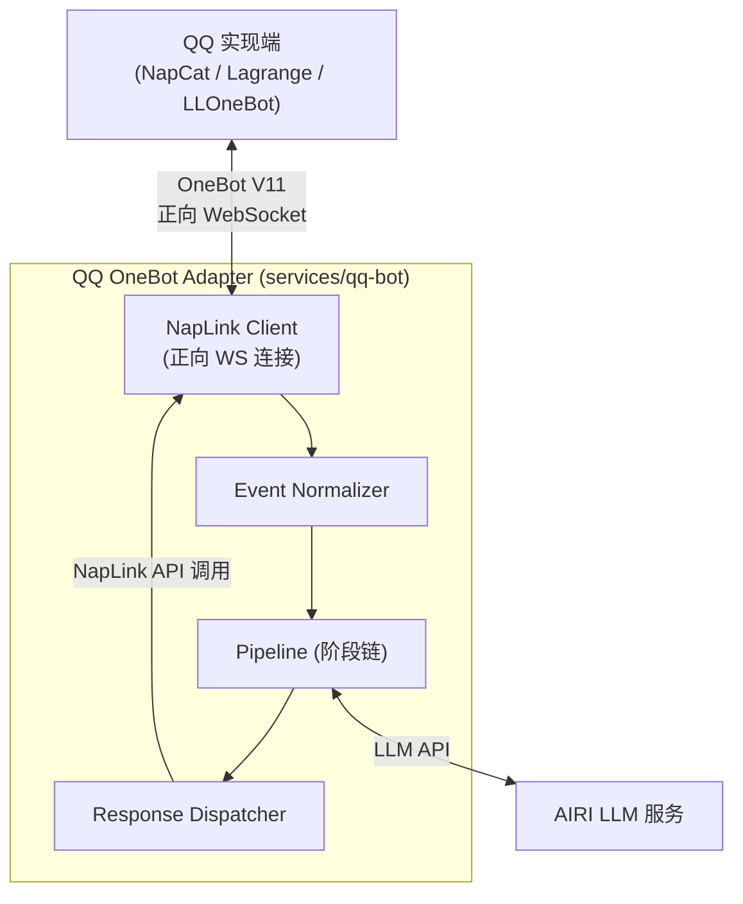

# Project AIRI — QQ OneBot 适配器设计文档

<aside>
📌

**项目状态：初始设计阶段** · 最后更新：2026-03-25 · 仓库：`services/qq-bot`（待创建）

Project AIRI 的 QQ 平台接入适配器，基于 OneBot V11 协议，使用 NapLink SDK 通过正向 WebSocket 连接 NapCat，采用流水线架构处理消息。

</aside>

## 项目概述

### 背景

Project AIRI（[github.com/moeru-ai/airi，⭐](http://github.com/moeru-ai/airi，⭐) 34.6K）是一个开源 AI 伴侣项目，目前已有 Telegram 和 Discord 适配器。本项目为 AIRI 新增 QQ 平台支持，通过 OneBot V11 协议接入。

### 设计原则

- **先专注 QQ，后抽象通用** — 当前对 QQ 特有概念（群、好友、临时会话、戳一戳等）做一等公民支持，流水线设计保持可扩展性但不急于跨协议抽象
- **规则前置，LLM 后置** — 唤醒判定、频率限制等用规则层前置过滤，节省 LLM token
- **配置驱动，非硬编码** — 所有行为参数通过统一配置文件管理，支持热重载
- **适配器只做协议转换** — 业务逻辑全部在流水线中处理

### 技术选型

- **语言**：TypeScript（与 AIRI 主仓库一致）
- **OneBot SDK**：[NapLink](https://naplink.github.io/)（`@naplink/naplink`）— 现代化 NapCat SDK，类型安全，内置重连/心跳/超时控制
- **连接方式**：正向 WebSocket（bot 主动连接 NapCat）
- **运行时**：Node.js

---

## 架构设计

### 整体架构图



### 四大模块

1. **NapLink Client** — 协议连接层，使用 NapLink SDK 管理正向 WebSocket 连接（内置心跳、指数退避重连、API 超时控制），不再需要手写 WS 逻辑
2. **Event Normalizer** — 从 NapLink 的层级化事件回调（如 `message.group`、`notice.notify.poke`）中提取数据，映射为统一的 `QQMessageEvent`
3. **Pipeline** — 可配置的 7 阶段链，消息在各阶段间流转
4. **Response Dispatcher** — 调用 NapLink 封装的 API 方法（如 `client.sendGroupMessage()`、`client.sendPrivateMessage()`）发送响应，不再手动构造 OneBot action JSON

---

## 统一事件模型

```tsx
// types/event.ts

interface QQMessageEvent {
  // 基本信息
  id: string // 消息唯一ID
  timestamp: number // 收到时间戳

  // 来源
  source: {
    platform: 'qq'
    type: 'private' | 'group' | 'guild' // 私聊/群聊/频道
    userId: string // 发送者QQ号
    userName: string // 昵称
    groupId?: string // 群号（群聊时）
    groupName?: string // 群名
    sessionId: string // 统一会话ID = "qq:{type}:{groupId|userId}"
  }

  // 消息内容
  raw: unknown // NapLink 原始事件 data（实际为 GroupMessageEventData 等，按需断言）
  chain: InputMessageSegment[] // 标准化消息链（P2：含 ReplySegment，输入侧）
  text: string // 纯文本提取（便于快速匹配）

  // 流水线上下文（各阶段可写入）
  context: PipelineContext

  // 控制
  stopped: boolean // 阶段可设置，中止后续流水线
}

interface MessageSegment {
  type: 'text' | 'image' | 'at' | 'reply' | 'face'
    | 'file' | 'voice' | 'forward' | 'poke'
  data: Record<string, unknown>
}

interface PipelineContext {
  isWakeUp: boolean // 是否触发了唤醒条件
  wakeReason?: string // 唤醒原因
  rateLimitPassed: boolean // 是否通过频率限制
  sessionHistory: InputMessageSegment[][] // 最近N条上下文（P2：输入侧）
  response?: ResponsePayload // undefined = 无阶段产生响应; kind:'silent' = 有意静默
  extensions: PipelineExtensions // 集中定义，见 pipeline/extensions.ts
}
```

---

## 流水线阶段设计（7 阶段）

参考 AstrBot 的 9 阶段流水线，针对 QQ 场景精简为 7 个阶段。


### 阶段返回值

```tsx
type StageResult
  = | { action: 'continue' } // 继续下一阶段
    | { action: 'skip' } // 跳过后续，不回复
    | { action: 'respond', payload: ResponsePayload } // 提前回复并终止
```

### ① FilterStage — 基础过滤

**职责**：过滤噪声消息（合并 AstrBot 的 WakingCheck + Whitelist）

**过滤逻辑**：

- 过滤 QQ 管家（`user_id: 2854196310`）等系统号
- 黑名单用户/群过滤
- 白名单模式（如果开启，仅允许白名单群/用户）
- 过滤空消息、纯表情消息（可配置）

**配置项**：

```tsx
filter: {
  blacklistUsers: string[]      // QQ号黑名单
  blacklistGroups: string[]     // 群号黑名单
  whitelistMode: boolean        // 是否启用白名单模式
  whitelistGroups: string[]     // 白名单群
  ignoreSystemUsers: string[]   // 系统用户 (默认含 QQ管家)
  ignoreEmptyMessages: boolean  // 过滤纯表情/空消息
}
```

### ② WakeStage — 唤醒判定

**职责**：判定这条消息是否需要 bot 响应

**唤醒条件（优先级从高到低）**：

1. 私聊消息 → 始终唤醒
2. @bot → 始终唤醒（去除 @段 后传递正文）
3. 回复 bot 消息 → 唤醒
4. 关键词触发 → 可配置的前缀/关键词列表
5. 随机唤醒 → 群聊中以概率 P 触发（模拟主动参与，可选）

**写入 context**：`isWakeUp`, `wakeReason`（`'private' | 'at' | 'reply' | 'keyword' | 'random'`）

**配置项**：

```tsx
wake: {
  keywords: string[]             // 触发关键词 ["airi", "爱莉"]
  keywordMatchMode: 'prefix' | 'contains' | 'regex'
  randomWakeRate: number         // 0~1, 群聊随机唤醒概率 (0=关闭)
  alwaysWakeInPrivate: boolean   // 私聊始终唤醒 (默认true)
}
```

### ③ RateLimitStage — 频率限制

**职责**：防止 bot 刷屏，独立为流水线阶段（参考 AstrBot）

**限制维度**：

- **per-session**：每个会话(群/私聊) N 条/分钟
- **per-user**：同一用户 N 条/分钟
- **global**：全局 N 条/分钟
- **cooldown**：回复后冷却 X 秒内不再响应同一会话

**被限流策略**：静默丢弃 或 回复提示

**配置项**：

```tsx
rateLimit: {
  perSession: { max: number, windowMs: number }   // e.g. { max: 10, windowMs: 60000 }
  perUser: { max: number, windowMs: number }
  global: { max: number, windowMs: number }
  cooldownMs: number              // 单次回复后冷却时间
  onLimited: 'silent' | 'notify'
  notifyMessage?: string          // 限流提示语
}
```

### ④ SessionStage — 会话上下文管理

**职责**：维护每个会话的消息历史，为 LLM 提供上下文

**行为**：

- 维护 per-session 的消息环形缓冲区（默认最近 50 条）
- 将历史注入 `context.sessionHistory`
- 支持上下文窗口裁剪（传给 LLM 时取最近 N 条）
- 会话超时重置（可配置，如 30 分钟无消息则清空上下文）

**配置项**：

```tsx
session: {
  maxHistoryPerSession: number // 缓冲区大小 (默认50)
  contextWindow: number // LLM上下文窗口 (默认20)
  timeoutMs: number // 会话超时 (默认 30min)
  isolateByTopic: boolean // QQ频道话题隔离 (预留)
}
```

### ⑤ ProcessStage — 核心处理

**职责**：消息的实际处理，业务逻辑核心

**处理优先级**：

1. **命令匹配** → `/help`, `/status`, `/clear` 等内置命令
2. **插件钩子** → 可注册的自定义处理器（预留扩展点）
3. **LLM 处理** → 通过 `@xsai/generate-text` 调用 OpenAI 兼容 LLM API

**LLM 处理流程**：构建 prompt → 通过 `@xsai/generate-text` 调用 OpenAI 兼容 API → 解析响应 → 写入 `context.response`

**配置项**：

```tsx
process: {
  commands: {
    prefix: string               // 命令前缀 (默认 "/")
    enabled: string[]            // 启用的内置命令
  }
  llm: {
    endpoint?: string            // YAML 优先，fallback: env.LLM_API_BASE_URL
    apiKey?: string              // YAML 优先，fallback: env.LLM_API_KEY
    model?: string               // YAML 优先，fallback: env.LLM_MODEL
    systemPrompt: string
    temperature: number
    maxTokens: number
  }
}
```

### ⑥ DecorateStage — 响应装饰

**职责**：对 LLM 输出做后处理，适配 QQ 消息格式

**行为**：

- 长消息分割（QQ 单条消息有长度限制）
- Markdown → QQ 消息格式转换
- ~~添加引用回复（reply segment）~~ → 改为设置 `response.replyTo ??= event.id`（声明式，Dispatcher 统一注入 ReplySegment）
- 图片/表情嵌入处理
- 敏感词替换/过滤（可选）

**配置项**：

```tsx
decorate: {
  maxMessageLength: number // 单条消息最大长度 (默认4500)
  splitStrategy: 'truncate' | 'multi-message'
  autoReply: boolean // 是否自动引用原消息
  contentFilter: {
    enabled: boolean
    replacements: Record<string, string>
  }
}
```

### ⑦ RespondStage — 发送响应

**职责**：把处理结果通过 NapLink API 发送

**行为**：

- 从 `context.response` 读取响应 → 调用 NapLink 封装的 `client.sendGroupMessage()` / `client.sendPrivateMessage()` 发送
- 多条消息间添加发送延迟（模拟打字）
- 合并转发消息（forward）的构造
- 发送失败重试：业务层最多 2 次（NapLink 自身也有 `api.retries` 兜底）

**配置项**：

```tsx
respond: {
  typingDelay: { min: number, max: number }  // 模拟打字延迟范围(ms)
  multiMessageDelay: number      // 多条消息间隔(ms)
  retryCount: number             // 发送失败重试次数
  retryDelayMs: number
}
```

---

## 流水线执行引擎

```tsx
// pipeline/runner.ts

class PipelineRunner {
  private stages: PipelineStage[]

  constructor(config: BotConfig) {
    this.stages = [
      new FilterStage(config.filter),
      new WakeStage(config.wake),
      new RateLimitStage(config.rateLimit),
      new SessionStage(config.session),
      new ProcessStage(config.process),
      new DecorateStage(config.decorate),
      new RespondStage(config.respond),
    ]
  }

  async run(event: QQMessageEvent): Promise<void> {
    for (const stage of this.stages) {
      const result = await stage.run(event) // 调 run() 而非 execute()，自动计时 + 日志
      if (result.action === 'skip')
        return
      if (result.action === 'respond') {
        await this.dispatcher.send(event, result.payload)
        return
      }
      // action === 'continue' → 进入下一阶段
    }
  }
}
```

---

## 完整配置文件结构

```tsx
// config.ts

import type { NapLinkConfig } from '@naplink/naplink'

interface BotConfig {
  // NapLink 连接配置（直接透传给 NapLink 构造函数）
  naplink: {
    connection: {
      url: string // NapCat WS 地址, e.g. "ws://localhost:3001"
      token?: string // 访问令牌（可选）
      timeout?: number // 连接超时 (默认 30000ms)
      pingInterval?: number // 心跳间隔 (默认 30000ms, 0=禁用)
    }
    reconnect?: {
      enabled?: boolean // 自动重连 (默认 true)
      maxAttempts?: number // 最大重连次数 (默认 10)
      backoff?: {
        initial?: number // 初始延迟 (默认 1000ms)
        max?: number // 最大延迟 (默认 60000ms)
        multiplier?: number // 退避倍数 (默认 2)
      }
    }
    logging?: {
      level?: 'debug' | 'info' | 'warn' | 'error' | 'off'
    }
    api?: {
      timeout?: number // API 调用超时 (默认 30000ms)
      retries?: number // API 失败重试次数 (默认 3)
    }
  }

  // 各阶段配置
  filter: FilterConfig
  wake: WakeConfig
  rateLimit: RateLimitConfig
  session: SessionConfig
  process: ProcessConfig
  decorate: DecorateConfig
  respond: RespondConfig

  // 全局
  // 全局日志级别（覆盖 NapLink 和各 Stage 的日志输出）
  logging?: {
    level?: 'debug' | 'info' | 'warn' | 'error' | 'off' // 默认 'info'
  }

  botQQ?: string // 可选，未设置时通过 client.getLoginInfo() 自动获取
}
```

<aside>
⚡

**配置优先级**：YAML 文件 > 环境变量 > 内置默认值

LLM 相关字段（`endpoint`、`apiKey`、`model`）支持 env fallback，解析逻辑：

`config.process.llm.endpoint ?? env.LLM_API_BASE_URL`

`config.process.llm.apiKey ?? env.LLM_API_KEY`

`config.process.llm.model ?? env.LLM_MODEL`

所有配置使用 Valibot schema 做运行时验证 + 默认值填充。

</aside>

---

## 目录结构

```jsx
services/qq-bot/
├── src/
│   ├── index.ts                 # 入口：初始化 NapLink → 注册事件 → client.connect()
│   ├── config.ts                # 配置类型 + 默认值 + 加载
│   ├── client.ts                # NapLink 实例创建与生命周期管理
│   ├── types/
│   │   ├── index.ts             # Barrel export（re-export 所有公共类型和工厂函数）
│   │   ├── context.ts           # PipelineContext + WakeReason + StageResult（决策 ①）
│   │   ├── event.ts             # QQMessageEvent + EventSource + buildSessionId
│   │   ├── message.ts           # MessageSegment 定义
│   │   └── response.ts          # ResponsePayload 定义
│   ├── normalizer/
│   │   └── index.ts             # NapLink 事件 data → QQMessageEvent 映射
│   ├── dispatcher/
│   │   └── index.ts             # 调用 NapLink API (sendGroupMessage 等) 发送响应
│   ├── pipeline/
│   │   ├── extensions.ts     # PipelineExtensions 集中定义
│   │   ├── runner.ts            # 流水线执行引擎
│   │   ├── stage.ts             # Stage 抽象接口
│   │   ├── filter.ts            # ① FilterStage
│   │   ├── wake.ts              # ② WakeStage
│   │   ├── rate-limit.ts        # ③ RateLimitStage
│   │   ├── session.ts           # ④ SessionStage
│   │   ├── process.ts           # ⑤ ProcessStage
│   │   ├── decorate.ts          # ⑥ DecorateStage
│   │   └── respond.ts           # ⑦ RespondStage
│   ├── commands/
│   │   ├── index.ts             # 命令注册表
│   │   ├── help.ts
│   │   ├── status.ts
│   │   └── clear.ts
│   └── utils/
│       ├── logger.ts                # 统一日志（两阶段初始化 + 注册表 + 彩色输出）
│       ├── naplink-logger-adapter.ts # NapLink Logger 接口适配层
│       ├── message-buffer.ts        # 环形缓冲区
│       └── rate-limiter.ts          # 令牌桶/滑动窗口实现
├── config.example.yaml          # 配置示例
├── package.json                 # 依赖: @naplink/naplink
└── tsconfig.json
```

---

## 详细类型架构

### 设计决策

1. **MessageSegment 使用 discriminated union** — 按 type 定义具体子类型（`TextSegment`, `ImageSegment`, `AtSegment` 等），Normalizer 和 Decorate 阶段可类型安全地操作
2. **PipelineStage 使用 abstract class** — 基类放通用逻辑（日志、耗时统计），各阶段 `extends` 后只需实现 `execute`
3. **Config 使用 Valibot schema 推断** — 一套 schema 同时产出 TS 类型和运行时验证器 + 默认值（`v.InferOutput<typeof BotConfigSchema>`）
4. **NapLink 原始类型直接引用** — `raw` 字段使用 NapLink SDK 导出的事件类型，Normalizer 输入也直接引用 NapLink 回调的 data 类型
5. **消息段类型：自定义 + Normalizer 转换** — NapLink 的消息段是宽泛的 `{ type: string, data: Record<string, any> }`，内部流转（`chain`、`ResponsePayload`）使用自定义 discriminated union 以获得类型安全；输入侧（`raw`、Normalizer 参数）保留 NapLink 原始类型。Normalizer 是唯一的转换点，通过 `switch(seg.type)` 做类型窄化，结构不变只收窄类型

### `src/types/message.ts` — 消息原子单元

```tsx
// 消息段类型枚举
type MessageSegmentType = 'text' | 'image' | 'at' | 'reply' | 'face'
  | 'file' | 'voice' | 'forward' | 'poke'

// 各消息段具体类型 (discriminated union)
interface TextSegment { type: 'text', data: { text: string } }
interface ImageSegment { type: 'image', data: { file: string, url?: string } }
interface AtSegment { type: 'at', data: { qq: string } } // qq='all' → @全体
interface ReplySegment { type: 'reply', data: { id: string } }
interface FaceSegment { type: 'face', data: { id: string } }
interface FileSegment { type: 'file', data: { file: string, name?: string } }
interface VoiceSegment { type: 'voice', data: { file: string } }
interface ForwardSegment { type: 'forward', data: { id: string } }
interface PokeSegment { type: 'poke', data: { type: string, id: string } }

// 统一联合类型
type MessageSegment = TextSegment | ImageSegment | AtSegment | ReplySegment
  | FaceSegment | FileSegment | VoiceSegment
  | ForwardSegment | PokeSegment

// ─── 工具函数 ───

/** 拼接所有 TextSegment 的纯文本（备用，Normalizer 直接取 raw_message） */
function extractText(chain: MessageSegment[]): string

/** 判断消息链是否包含指定类型的消息段 */
function hasSegmentType(chain: MessageSegment[], type: MessageSegmentType): boolean

/** 判断消息链是否 @了 bot */
function findAtTarget(chain: MessageSegment[], botQQ: string): boolean

/** 移除消息链中 @bot 的段（WakeStage 在 @唤醒后去除 @段） */
function removeAtSegments(chain: MessageSegment[], botQQ: string): MessageSegment[]
```

[开发工作流](https://www.notion.so/e2af9d7b98ba4ad9a7e2d8df2ef9e521?pvs=21)

**最终合成代码（含 ESLint 修复）**

```tsx
// src/types/message.ts
// ─────────────────────────────────────────────────────────────
// 消息段（MessageSegment）类型定义 & 工具函数
//
// 功能：定义 QQ Bot 内部流转的消息原子单元，并提供基础操作工具集。
// 设计依据：
//   - OneBot V11 协议的消息段模型为 { type, data }，本文件在此基础上
//     使用 TypeScript discriminated union 做类型收窄，使 Normalizer、
//     DecorateStage 等模块可通过 switch(seg.type) 获得完整的类型安全。
//   - NapLink SDK 的消息段是宽泛的 { type: string, data: Record<string, any> }，
//     我们在内部流转（chain、ResponsePayload）中使用自定义的强类型定义，
//     Normalizer 是唯一的 NapLink → 内部类型 转换点。
//   - 当前覆盖 9 种 QQ 常用消息段类型，后续可按需扩展。
// ─────────────────────────────────────────────────────────────

/**
 * 所有支持的消息段类型字面量联合。
 * 用于泛型约束、运行时类型判断等场景。
 */
export type MessageSegmentType
  = | 'text'
    | 'image'
    | 'at'
    | 'reply'
    | 'face'
    | 'file'
    | 'voice'
    | 'forward'
    | 'poke'

// ─── 具体消息段接口 ───────────────────────────────────────────
// 每个接口以 type 字面量作为判别字段（discriminant），
// data 中只保留该类型必需/可选的字段，保持最小化。

/** 纯文本消息段 */
export interface TextSegment {
  type: 'text'
  data: { text: string }
}

/**
 * 图片消息段
 * - file: 图片文件标识（可以是本地路径、URL 或 Base64，取决于 OneBot 实现端）
 * - url:  图片的可访问 URL（收到消息时由实现端填充，发送时可选）
 */
export interface ImageSegment {
  type: 'image'
  data: { file: string, url?: string }
}

/**
 * @提及消息段
 * - qq: 被 @ 的用户 QQ 号；特殊值 'all' 表示 @全体成员
 */
export interface AtSegment {
  type: 'at'
  data: { qq: string }
}

/**
 * 引用回复消息段
 * - id: 被引用的原消息 ID（OneBot message_id）
 */
export interface ReplySegment {
  type: 'reply'
  data: { id: string }
}

/**
 * QQ 表情消息段
 * - id: QQ 表情的数字 ID（对应 QQ 内置表情编号）
 */
export interface FaceSegment {
  type: 'face'
  data: { id: string }
}

/**
 * 文件消息段
 * - file: 文件标识
 * - name: 可选的文件显示名称
 */
export interface FileSegment {
  type: 'file'
  data: { file: string, name?: string }
}

/** 语音消息段 */
export interface VoiceSegment {
  type: 'voice'
  data: { file: string }
}

/**
 * 合并转发消息段
 * - id: 转发消息的 resId（通过此 ID 可获取完整转发内容）
 */
export interface ForwardSegment {
  type: 'forward'
  data: { id: string }
}

/**
 * 戳一戳消息段
 * - type: 戳一戳的子类型（如 "poke"、"ShowLove" 等，由 QQ 定义）
 * - id:   戳一戳的子类型 ID
 * 注意：data.type 与外层的 type: 'poke' 不冲突，前者描述戳一戳的具体动作，
 *       后者是 discriminated union 的判别字段。
 */
export interface PokeSegment {
  type: 'poke'
  data: { type: string, id: string }
}

// ─── 联合类型 ────────────────────────────────────────────────

/**
 * 消息段联合类型（Discriminated Union）。
 * 在内部流水线中作为消息链 (MessageSegment[]) 的元素类型使用。
 *
 * 使用方式：
 *   switch (seg.type) {
 *     case 'text':  seg.data.text   // TS 自动窄化为 TextSegment
 *     case 'image': seg.data.file   // TS 自动窄化为 ImageSegment
 *     ...
 *   }
 */
export type MessageSegment
  = | TextSegment
    | ImageSegment
    | AtSegment
    | ReplySegment
    | FaceSegment
    | FileSegment
    | VoiceSegment
    | ForwardSegment
    | PokeSegment

// ─── 输入/输出侧联合类型（P2 新增） ─────────────────────────

/** 输入侧消息段（含 ReplySegment），用于 event.chain、sessionHistory */
export type InputMessageSegment = MessageSegment

/** 输出侧消息段（不含 ReplySegment），用于 ResponsePayload.segments */
export type OutputMessageSegment = Exclude<MessageSegment, ReplySegment>

// ─── 工具函数 ────────────────────────────────────────────────
// 以下函数是消息链的基础操作工具集，供 Normalizer、WakeStage、
// DecorateStage 等模块使用。
//
// 设计原则：
//   - 全部为纯函数，不修改传入的 chain（.filter()/.map() 天然返回新数组）
//   - 空数组输入返回合理默认值（空字符串 / false / 空数组）
//   - 签名与设计文档一致，便于各模块按文档约定直接调用

/**
 * 拼接消息链中所有 TextSegment 的纯文本。
 *
 * 功能：从混合类型的消息链中提取文本内容，返回拼接后的字符串。
 * 设计依据：
 *   - Normalizer 优先使用 NapLink 的 raw_message 作为 event.text，
 *     本函数作为备用方案，用于需要从修改后的消息链重新提取文本的场景
 *     （如 DecorateStage 对消息链做变换后重新拼接）。
 *   - 不插入分隔符，因为 QQ 消息链中相邻 TextSegment 的文本
 *     本身已包含完整的空格和标点。
 *
 * @param chain - 消息段数组
 * @returns 拼接后的纯文本字符串；空链返回 ''
 */
export function extractText(chain: MessageSegment[]): string {
  return chain
    .filter((seg): seg is TextSegment => seg.type === 'text')
    .map(seg => seg.data.text)
    .join('')
}

/**
 * 判断消息链是否包含指定类型的消息段。
 *
 * 功能：通用的消息段类型检测，各流水线阶段均可使用。
 * 设计依据：
 *   - FilterStage 用于判断是否为纯表情消息（仅含 'face' 段）
 *   - WakeStage 用于判断是否包含 'reply' 段（回复 bot 唤醒条件）
 *   - 其他阶段按需使用，避免重复编写 .some() 逻辑
 *
 * @param chain - 消息段数组
 * @param type - 要检测的消息段类型
 * @returns 存在该类型返回 true；空链返回 false
 */
export function hasSegmentType(chain: MessageSegment[], type: MessageSegmentType): boolean {
  return chain.some(seg => seg.type === type)
}

/**
 * 判断消息链是否 @了指定的 bot。
 *
 * 功能：检测消息链中是否存在指向 bot 的 AtSegment。
 * 设计依据：
 *   - WakeStage 的 @bot 唤醒条件依赖此函数。
 *   - @全体成员（qq: 'all'）不视为 @bot：
 *     条件 seg.data.qq === botQQ 天然排除 'all'，
 *     因为合法 QQ 号不可能等于字符串 'all'。
 *   - 不考虑 @bot 出现多次的情况——只要存在一个即返回 true。
 *
 * @param chain - 消息段数组
 * @param botQQ - bot 的 QQ 号字符串
 * @returns 消息链中存在 @bot 返回 true；否则（含空链）返回 false
 */
export function findAtTarget(chain: InputMessageSegment[], botQQ: string): boolean {
  return chain.some(seg => seg.type === 'at' && seg.data.qq === botQQ)
}

/**
 * 从消息链中移除所有 @bot 的消息段，返回新数组。
 *
 * 功能：在 @bot 唤醒后，清理消息链中的 @bot 段，
 *       使后续阶段（ProcessStage）只处理实际内容。
 * 设计依据：
 *   - WakeStage 判定 @bot 唤醒后调用此函数，将清理后的 chain
 *     写回 event.chain，避免 LLM 收到无意义的 @段。
 *   - 仅移除 @bot 的段，保留 @其他用户 和 @全体成员（'all'），
 *     因为这些信息对 LLM 理解群聊语境可能有价值。
 *   - .filter() 天然返回新数组，不会修改原始 chain（纯函数保证）。
 *   - 使用德摩根定律展开保留条件（ESLint de-morgan/no-negated-conjunction）。
 *
 * @param chain - 消息段数组
 * @param botQQ - bot 的 QQ 号字符串
 * @returns 移除 @bot 段后的新消息段数组；空链返回 []
 */
export function removeAtSegments(chain: InputMessageSegment[], botQQ: string): InputMessageSegment[] {
  return chain.filter(seg => seg.type !== 'at' || seg.data.qq !== botQQ)
}
```

### `src/types/response.ts` — 响应载荷

```tsx
// ─── ResponsePayload（Discriminated Union） ───
// P1 修复：用 kind 判别字段强制 segments/forward 互斥
// P2 修复：segments 使用 OutputMessageSegment[]，ReplySegment 仅由 Dispatcher 注入
// P6 修复：新增 silent 分支，消除 null/undefined 语义模糊
// P5 修复：移除无消费方的 metadata 字段（YAGNI）

type ResponsePayload
  = | MessageResponse
    | ForwardResponse
    | SilentResponse

interface MessageResponse {
  kind: 'message'
  segments: OutputMessageSegment[] // 要发送的消息链（P2：不含 ReplySegment）
  replyTo?: string // 引用回复的消息 ID（Dispatcher 统一转换为 ReplySegment）
}

interface ForwardResponse {
  kind: 'forward'
  forward: ForwardNode[] // 合并转发节点
}

interface SilentResponse {
  kind: 'silent' // 流水线正常走完但不发送消息
}

// TODO: nested forward — OneBot V11 支持 forward 节点的 content 中
// 再嵌套 ForwardSegment，当前设计暂不支持，需在 ForwardNode 类型
// 和 Dispatcher.sendForward() 中处理递归构造。
interface ForwardNode {
  name: string // 显示的发送者名
  uin: string // 显示的发送者 QQ
  content: OutputMessageSegment[] // P3：统一为 segments，string 转换由 createForwardNode 工厂函数承担
  time?: number // P4：伪造发送时间（Unix 秒级），不填则由实现端填充当前时间
}

// ─── 互斥保证 ───
// kind 判别字段 + discriminated union 在编译期强制互斥：
//   switch(payload.kind) 自动窄化，case 'message' 只能访问 segments/replyTo，
//   case 'forward' 只能访问 forward，case 'silent' 无额外字段。
// 工厂函数返回窄类型，调用方无法构造非法组合。

// ─── 工厂函数 ───

/**
 * 通用 MessageResponse 工厂（P12 新增）
 * 所有 message 分支的构造都应通过此函数，确保 P8 空数组校验生效。
 * @throws segments 为空数组时 throw Error（P8：fail-fast）
 */
function createMessageResponse(
  segments: OutputMessageSegment[],
  replyTo?: string
): MessageResponse

/**
 * 纯文本响应快捷方式（内部调用 createMessageResponse）
 * @throws text 为空字符串时 throw Error（P8：fail-fast）
 * 等价于：createMessageResponse([{ type: 'text', data: { text } }], replyTo)
 */
function createTextResponse(text: string, replyTo?: string): MessageResponse

/**
 * 构造合并转发响应（返回窄类型 ForwardResponse）
 * 节点应通过 createForwardNode() 构造，确保 content 已统一为 OutputMessageSegment[]。
 * @throws nodes 为空数组时 throw Error（P8：fail-fast）
 */
function createForwardResponse(nodes: ForwardNode[]): ForwardResponse

/**
 * 构造合并转发节点（P3 + P4）
 * string 重载入口：内部将纯文本转换为 [TextSegment]，
 * 使 ForwardNode.content 统一为 OutputMessageSegment[]。
 * P4：time 可选参数，用于伪造发送时间（Unix 秒级）。
 * P10：time > 1e12 时自动转换为秒级 + logger.warn。
 */
function createForwardNode(name: string, uin: string, content: string, time?: number): ForwardNode
function createForwardNode(name: string, uin: string, content: OutputMessageSegment[], time?: number): ForwardNode

/**
 * 构造静默响应（P6）
 * 适用场景：插件已处理、webhook 已触发等无需用户感知的后台操作。
 * 注意：需要用户反馈的命令（如 /clear）应用 createTextResponse，非 silent。
 */
function createSilentResponse(): SilentResponse

/**
 * 合并相邻 TextSegment（P11）
 * DecorateStage 出口处调用，确保 segments 到达 Dispatcher 时相邻 text 段已合并。
 * 纯函数，返回新数组。
 */
function mergeAdjacentText(segments: OutputMessageSegment[]): OutputMessageSegment[]
```

[开发工作流](https://www.notion.so/4c3e6bef06ea4be98ac536ed7015d9ca?pvs=21)

**最终合成代码（含全部修复 + 重写注释）**

```tsx
// src/types/response.ts
// ─────────────────────────────────────────────────────────────
// 响应载荷（ResponsePayload）类型定义 & 工厂函数
//
// 功能：定义流水线输出的三种响应形态（消息、合并转发、静默），
//       并提供类型安全的构造入口，确保各分支字段在编译期互斥。
// 设计依据：
//   - 使用 kind 判别字段 + TypeScript discriminated union，
//     switch(payload.kind) 自动窄化，编译期杜绝 segments/forward 混用。
//   - 输出侧消息段使用 OutputMessageSegment（不含 ReplySegment），
//     ReplySegment 仅由 Dispatcher 在发送前根据 replyTo 注入，
//     保证引用回复的单一声明式入口。
//   - 工厂函数返回窄类型（MessageResponse / ForwardResponse / SilentResponse），
//     调用方无法构造非法组合；所有空值边界 fail-fast（throw Error）。
//   - 移除无消费方的 metadata 字段（YAGNI），阶段间共享数据
//     由 PipelineContext.extensions（强类型）承担。
// 接口：
//   - 类型：ResponsePayload, MessageResponse, ForwardResponse,
//           SilentResponse, ForwardNode
//   - 工厂：createMessageResponse, createTextResponse,
//           createForwardResponse, createForwardNode, createSilentResponse
//   - 工具：mergeAdjacentText
// ─────────────────────────────────────────────────────────────

import type { OutputMessageSegment } from './message'

import { createLogger } from '../utils/logger'

// ─── 惰性 Logger ─────────────────────────────────────────────
// 避免模块加载时 config 尚未就绪导致 createLogger 拿到默认配置。
// 首次调用 getLogger() 时才实例化，此后复用同一实例。

let _logger: ReturnType<typeof createLogger> | undefined
function getLogger() {
  return (_logger ??= createLogger('response'))
}

// ─── ResponsePayload（Discriminated Union） ───────────────────
// 流水线输出的三种响应形态，以 kind 字面量作为判别字段。
//
// 使用方式：
//   switch (payload.kind) {
//     case 'message': payload.segments  // TS 窄化为 MessageResponse
//     case 'forward': payload.forward   // TS 窄化为 ForwardResponse
//     case 'silent':  /* no-op */       // TS 窄化为 SilentResponse
//   }

/**
 * 响应载荷联合类型。
 * ProcessStage / 命令处理器通过工厂函数构造，Dispatcher 按 kind 分发。
 */
export type ResponsePayload
  = | MessageResponse
    | ForwardResponse
    | SilentResponse

/**
 * 消息响应 — 发送一条或多条消息段组成的消息。
 * - segments: 输出侧消息段数组（不含 ReplySegment）
 * - replyTo:  可选的引用回复目标消息 ID，Dispatcher 统一转换为 ReplySegment
 */
export interface MessageResponse {
  kind: 'message'
  segments: OutputMessageSegment[]
  replyTo?: string
}

/**
 * 合并转发响应 — 发送一组合并转发节点。
 * - forward: 转发节点数组，每个节点包含伪造的发送者信息和消息内容
 */
export interface ForwardResponse {
  kind: 'forward'
  forward: ForwardNode[]
}

/**
 * 静默响应 — 流水线正常走完但不发送消息。
 * 适用场景：插件已处理、webhook 已触发等无需用户感知的后台操作。
 * 注意：需要用户反馈的命令（如 /clear）应用 createTextResponse，非 silent。
 */
export interface SilentResponse {
  kind: 'silent'
}

// ─── ForwardNode ─────────────────────────────────────────────

// TODO: nested forward — OneBot V11 支持 forward 节点的 content 中
// 再嵌套 ForwardSegment，当前设计暂不支持，需在 ForwardNode 类型
// 和 Dispatcher.sendForward() 中处理递归构造。

/**
 * 合并转发节点。
 * - name:    显示的发送者昵称
 * - uin:     显示的发送者 QQ 号
 * - content: 节点消息内容（OutputMessageSegment[]，不含 ReplySegment）
 * - time:    可选的伪造发送时间（Unix 秒级），不填则由实现端填充当前时间
 */
export interface ForwardNode {
  name: string
  uin: string
  content: OutputMessageSegment[]
  time?: number
}

// ─── 工厂函数 ────────────────────────────────────────────────
// 所有 ResponsePayload 的构造都应通过工厂函数，确保：
//   - 空值边界 fail-fast（throw Error），不静默吞错
//   - ForwardNode.time 毫秒防呆（自动转换 + warn）
//   - ForwardNode.content 统一为 OutputMessageSegment[]
//   - replyTo 空字符串视为无效，不写入
// 工厂函数返回窄类型，调用方无法构造非法组合。

/**
 * 构造静默响应。
 *
 * 功能：创建一个 kind='silent' 的响应载荷，表示不发送任何消息。
 * 设计依据：
 *   - 消除 null/undefined 的语义模糊：undefined = 没有阶段产生响应，
 *     silent = 有意选择不回复。Dispatcher 遇到 silent 直接 return。
 *   - 适用场景：插件已处理、webhook 已触发等后台操作。
 *
 * @returns SilentResponse（窄类型）
 */
export function createSilentResponse(): SilentResponse {
  return { kind: 'silent' }
}

/**
 * 通用消息响应工厂。
 *
 * 功能：构造 kind='message' 的响应载荷，所有消息分支的构造都应通过此函数。
 * 设计依据：
 *   - 空 segments 数组 = 上游 bug（LLM 返空 / 逻辑遗漏），fail-fast throw。
 *   - replyTo 空字符串视为无效消息 ID，不写入（避免 Dispatcher 注入
 *     { type: 'reply', data: { id: '' } }，NapCat 行为未定义）。
 *   - 返回窄类型 MessageResponse，赋值给 ResponsePayload 变量时自动 widen。
 *
 * @param segments - 输出侧消息段数组（不含 ReplySegment）
 * @param replyTo - 可选的引用回复目标消息 ID
 * @returns MessageResponse（窄类型）
 * @throws segments 为空数组时 throw Error
 */
export function createMessageResponse(
  segments: OutputMessageSegment[],
  replyTo?: string,
): MessageResponse {
  if (segments.length === 0)
    throw new Error('createMessageResponse: segments must not be empty')

  return {
    kind: 'message',
    segments,
    ...(replyTo && { replyTo }),
  }
}

/**
 * 纯文本响应快捷方式。
 *
 * 功能：将纯文本字符串包装为 MessageResponse，内部委托 createMessageResponse。
 * 设计依据：
 *   - ProcessStage / 命令处理器最常见的输出是纯文本，提供便捷入口。
 *   - 空字符串 = 上游 bug，fail-fast throw（与 createMessageResponse 一致）。
 *   - 等价于 createMessageResponse([{ type: 'text', data: { text } }], replyTo)。
 *
 * @param text - 响应文本内容
 * @param replyTo - 可选的引用回复目标消息 ID
 * @returns MessageResponse（窄类型）
 * @throws text 为空字符串时 throw Error
 */
export function createTextResponse(
  text: string,
  replyTo?: string,
): MessageResponse {
  if (!text)
    throw new Error('createTextResponse: text must not be empty')

  return createMessageResponse(
    [{ type: 'text', data: { text } }],
    replyTo,
  )
}

/**
 * 构造合并转发节点（字符串重载）。
 *
 * @param name - 显示的发送者昵称
 * @param uin - 显示的发送者 QQ 号
 * @param content - 纯文本内容（内部转换为 [TextSegment]）
 * @param time - 可选的伪造发送时间（Unix 秒级）
 */
export function createForwardNode(
  name: string,
  uin: string,
  content: string,
  time?: number,
): ForwardNode
/**
 * 构造合并转发节点（消息段数组重载）。
 *
 * @param name - 显示的发送者昵称
 * @param uin - 显示的发送者 QQ 号
 * @param content - 输出侧消息段数组
 * @param time - 可选的伪造发送时间（Unix 秒级）
 */
export function createForwardNode(
  name: string,
  uin: string,
  content: OutputMessageSegment[],
  time?: number,
): ForwardNode
/**
 * 构造合并转发节点（实现体）。
 *
 * 功能：创建 ForwardNode，统一 content 为 OutputMessageSegment[]。
 * 设计依据：
 *   - string 重载：内部转换为 [TextSegment]，Dispatcher 不再需要做
 *     typeof 分支判断，ForwardNode.content 始终是单一类型。
 *   - 空 content 数组 = 上游 bug，fail-fast throw。
 *   - time 毫秒防呆：JS Date.now() 返回毫秒，OneBot V11 time 为秒级，
 *     传入 > 1e12 时自动 Math.floor(÷1000) + warn，不 throw（意图明确，
 *     只是单位搞错）。
 *   - time ≤ 0（Unix epoch 或负值）几乎 100% 是 bug，warn + 忽略。
 *
 * @param name - 显示的发送者昵称
 * @param uin - 显示的发送者 QQ 号
 * @param content - 纯文本或输出侧消息段数组
 * @param time - 可选的伪造发送时间（Unix 秒级）
 * @returns ForwardNode
 * @throws content 为空数组时 throw Error
 */
export function createForwardNode(
  name: string,
  uin: string,
  content: string | OutputMessageSegment[],
  time?: number,
): ForwardNode {
  const segments: OutputMessageSegment[]
    = typeof content === 'string'
      ? [{ type: 'text', data: { text: content } }]
      : content

  if (segments.length === 0)
    throw new Error('createForwardNode: content must not be empty')

  let resolvedTime = time
  if (resolvedTime != null && resolvedTime > 1e12) {
    getLogger().warn(
      'ForwardNode.time appears to be in milliseconds, auto-converting to seconds',
    )
    resolvedTime = Math.floor(resolvedTime / 1000)
  }

  if (resolvedTime != null && resolvedTime <= 0) {
    getLogger().warn(
      'ForwardNode.time is <= 0 (Unix epoch or negative), ignoring',
    )
    resolvedTime = undefined
  }

  return {
    name,
    uin,
    content: segments,
    ...(resolvedTime != null && { time: resolvedTime }),
  }
}

/**
 * 构造合并转发响应。
 *
 * 功能：创建 kind='forward' 的响应载荷。
 * 设计依据：
 *   - 节点应通过 createForwardNode() 构造，确保 content 已统一为
 *     OutputMessageSegment[]。
 *   - 空节点数组 = 上游 bug，NapCat sendGroupForwardMessage 行为未定义，
 *     fail-fast throw。
 *
 * @param nodes - 合并转发节点数组（应通过 createForwardNode 构造）
 * @returns ForwardResponse（窄类型）
 * @throws nodes 为空数组时 throw Error
 */
export function createForwardResponse(
  nodes: ForwardNode[],
): ForwardResponse {
  if (nodes.length === 0)
    throw new Error('createForwardResponse: nodes must not be empty')

  return { kind: 'forward', forward: nodes }
}

// ─── 工具函数 ────────────────────────────────────────────────

/**
 * 合并相邻 TextSegment 为单个段。
 *
 * 功能：遍历消息段数组，将连续的 TextSegment 合并（拼接 data.text），
 *       非 text 段原样保留。
 * 设计依据：
 *   - LLM 返回文本经 DecorateStage 分割后可能产出连续 TextSegment，
 *     OneBot 实现端对连续 text 段的渲染行为未明确定义（可能拼接、
 *     可能换行、可能各实现不同）。
 *   - DecorateStage 出口处调用此函数，确保 segments 到达 Dispatcher
 *     时相邻 text 段已合并。
 *   - 纯函数，返回新数组，不修改传入的 segments。
 *   - 合并时创建新的 TextSegment 对象（不修改原对象），保持不可变性。
 *
 * @param segments - 输出侧消息段数组
 * @returns 合并后的新数组；空数组输入 → 返回空数组
 */
export function mergeAdjacentText(
  segments: OutputMessageSegment[],
): OutputMessageSegment[] {
  if (segments.length === 0)
    return []

  const result: OutputMessageSegment[] = []

  for (const seg of segments) {
    const prev = result.at(-1)
    if (seg.type === 'text' && prev?.type === 'text') {
      result[result.length - 1] = {
        type: 'text',
        data: { text: prev.data.text + seg.data.text },
      }
    }
    else {
      result.push(seg)
    }
  }

  return result
}
```

[实现前决策（P8–P11）](https://www.notion.so/P8-P11-5e0373206f624f298f7ff1a6439cee74?pvs=21)

### `src/utils/logger.ts` — 日志工具

**最终合成代码**

```tsx
// src/utils/logger.ts
// ─────────────────────────────────────────────────────────────
// 统一日志模块
//
// 功能：承担项目内所有日志输出的统一入口，替代 @guiiai/logg，
//       无外部日志依赖。同时兼容 NapLink SDK 的自定义 Logger 接口
//       （通过 naplink-logger-adapter.ts 适配）。
//
// 设计依据：
//   核心问题是 **模块加载时序**：各模块（response.ts、stage.ts 等）
//   在顶层 import 时就需要 logger 实例，但此时 config 尚未加载。
//   解决方案：两阶段初始化。
//     阶段一：createLogger('ns') 立即返回可用实例，用默认 info 级别。
//     阶段二：main() 中 loadConfig() 后调 initLoggers(config)，
//            遍历全局注册表统一刷新级别。
//   参考 AstrBot 的 LogManager.GetLogger + configure_logger 模式，
//   但用更轻量的 Set<LoggerInstance> 替代 loguru sink。
//
// 消费方：
//   1. response.ts — getLogger() 惰性初始化
//   2. NapLink — 通过 NapLinkLoggerAdapter 注入
//   3. PipelineStage 基类 — run() 模板方法自动计时
//   4. 各流水线阶段 — 通过基类间接使用
// ─────────────────────────────────────────────────────────────

// ESLint: no-restricted-globals 要求显式导入 process 而非使用全局变量
import process from 'node:process'

// ─── 级别定义 ────────────────────────────────────────────────
// 功能：定义 5 个日志级别的数值映射，用于级别比较过滤。
// 设计依据：
//   - 与 NapLink 的 logging.level 配置对齐（同为这 5 个级别），
//     确保 NapLinkLoggerAdapter 的级别语义一致。
//   - 'off' = 4 表示关闭所有输出，任何 LOG_LEVELS[level] 都 < 4。
//   - as const 保证值不可变 + 字面量类型推断。

const LOG_LEVELS = { debug: 0, info: 1, warn: 2, error: 3, off: 4 } as const
type LogLevel = keyof typeof LOG_LEVELS

// ─── 彩色输出 ────────────────────────────────────────────────
// 功能：开发环境彩色终端输出，提升可读性。
// 设计依据：
//   - 遵循 NO_COLOR 标准（https://no-color.org/）：设置该环境变量
//     则禁用彩色。CI/CD 管道、日志聚合等场景通常需要纯文本。
//   - process.stdout?.isTTY：仅在交互式终端启用色彩，
//     管道输出（如 `node app | tee log.txt`）自动禁用。
//     可选链防止某些运行时 stdout 为 undefined。
//   - 模块加载时一次性计算，运行期不再判断（性能无关但代码简洁）。

const USE_COLOR = !process.env.NO_COLOR && process.stdout?.isTTY

// ANSI 转义序列：每个级别对应一种前景色
const LEVEL_COLORS: Record<LogLevel, string> = {
  debug: '\x1B[90m', // gray — 调试信息低调显示
  info: '\x1B[36m', // cyan — 常规信息
  warn: '\x1B[33m', // yellow — 警告醒目但不刺眼
  error: '\x1B[31m', // red — 错误高优先级
  off: '', // off 级别不会输出，无需颜色
}
const RESET = '\x1B[0m'

// ─── 全局注册表 ──────────────────────────────────────────────
// 功能：追踪所有已创建的 LoggerInstance，供 initLoggers() 遍历更新。
// 设计依据：
//   - Set 而非 Array：O(1) 添加，无重复（虽然实际不会重复）。
//   - 弱引用不适用：logger 生命周期 = 进程生命周期，不需要 GC 回收。
//   - globalLevel 作为新实例的默认级别 fallback，initLoggers() 更新后
//     后续 createLogger() 创建的实例也自动继承新级别。

const registry = new Set<LoggerInstance>()
let globalLevel: LogLevel = 'info'

// ─── LoggerInstance 类 ──────────────────────────────────────
// 功能：单个命名空间的日志实例，提供 debug/info/warn/error 四个输出方法。
// 设计依据：
//   - 用 class 而非闭包工厂：PipelineStage 基类需要声明
//     `protected logger!: LoggerInstance` 类型标注，class 可直接作为类型使用。
//   - 构造时自动注册到全局 registry，确保 initLoggers() 能触达所有实例。
//   - namespace 作为 readonly 公共属性暴露，供 PipelineStage.run() 的
//     调试日志引用（如 "[FilterStage] execute took 2.3ms"）。

export class LoggerInstance {
  private level: LogLevel

  constructor(
    public readonly namespace: string,
    level?: LogLevel,
  ) {
    // 未指定级别时 fallback 到 globalLevel，保证 config 就绪前也能正常工作
    this.level = level ?? globalLevel
    // 注册到全局表，initLoggers() 遍历时会更新此实例
    registry.add(this)
  }

  /** 外部更新级别入口（initLoggers 遍历调用） */
  setLevel(level: LogLevel): void {
    this.level = level
  }

  /**
   * 级别门控：比较当前消息级别与实例阈值。
   * 设计依据：数值比较（O(1)）比字符串查表更快，
   *          as const 保证 LOG_LEVELS 值为字面量类型，TS 编译期可验证。
   */
  private shouldLog(level: LogLevel): boolean {
    return LOG_LEVELS[level] >= LOG_LEVELS[this.level]
  }

  /**
   * 格式化日志行。
   * 输出格式：[HH:mm:ss.SSS] [LEVEL] [namespace] message
   * 设计依据：
   *   - HH:mm:ss.SSS 而非 ISO-8601 全格式：适配器是 CLI 应用，
   *     简短时间戳在终端中可读性更好（参考 NapLink 带时间戳但更简洁）。
   *   - padEnd(5) 对齐级别标签：DEBUG/INFO_/WARN_/ERROR 等宽，
   *     终端输出列对齐。
   *   - 不含版本号、源码行号等元信息（YAGNI，AstrBot 也省略了这些）。
   */
  private format(level: LogLevel, message: string): string {
    const now = new Date()
    const time = `${pad(now.getHours())}:${pad(now.getMinutes())}:${pad(now.getSeconds())}.${pad3(now.getMilliseconds())}`
    const tag = level.toUpperCase().padEnd(5)
    return `[${time}] [${tag}] [${this.namespace}] ${message}`
  }

  /**
   * 统一输出方法，所有公共方法（debug/info/warn/error）委托于此。
   * 设计依据：
   *   - 三元选择 console 方法：error → console.error（stderr），
   *     warn → console.warn（stderr），其余 → console.info（stdout）。
   *     不用 console.log 因为 ESLint 规则只允许 warn/error/info。
   *   - args 透传：支持 logger.info('user %s', name) 和
   *     logger.debug('data', { key: value }) 两种用法，
   *     与 NapLink Logger 接口的 ...meta 签名兼容。
   *   - USE_COLOR 分支：彩色模式下整行包裹 ANSI 序列，
   *     额外 args 不着色（通常是对象，由终端自行渲染）。
   */
  private output(level: LogLevel, message: string, args: unknown[]): void {
    if (!this.shouldLog(level))
      return
    const formatted = this.format(level, message)
    // ESLint: 只允许 console.warn / console.error / console.info
    const fn = level === 'error'
      ? console.error
      : level === 'warn'
        ? console.warn
        : console.info
    if (USE_COLOR) {
      fn(`${LEVEL_COLORS[level]}${formatted}${RESET}`, ...args)
    }
    else {
      fn(formatted, ...args)
    }
  }

  // ─── 公共输出方法 ───
  // 签名与 NapLink Logger 接口对齐（msg + ...meta），
  // NapLinkLoggerAdapter 可直接委托调用。
  debug(msg: string, ...args: unknown[]) { this.output('debug', msg, args) }
  info(msg: string, ...args: unknown[]) { this.output('info', msg, args) }
  warn(msg: string, ...args: unknown[]) { this.output('warn', msg, args) }
  error(msg: string, ...args: unknown[]) { this.output('error', msg, args) }
}

// ─── 时间格式化辅助 ─────────────────────────────────────────
// 独立函数而非类方法：纯工具逻辑，不依赖实例状态。
function pad(n: number): string { return String(n).padStart(2, '0') }
function pad3(n: number): string { return String(n).padStart(3, '0') }

// ─── 公共 API ────────────────────────────────────────────────

/**
 * 创建带命名空间的 logger 实例。
 *
 * 功能：阶段一入口 — 模块 import 时即可调用，立即返回可用实例。
 * 设计依据：
 *   - 无需传入 config：用 globalLevel（默认 'info'）作为初始级别，
 *     initLoggers() 后自动刷新。解决模块加载时序问题。
 *   - response.ts 的惰性用法（_logger ??= createLogger('response')）
 *     也能正确工作：延迟创建时若 initLoggers 已执行，
 *     globalLevel 已更新，新实例直接拿到正确级别。
 */
export function createLogger(namespace: string): LoggerInstance {
  return new LoggerInstance(namespace)
}

/**
 * 全局初始化 / 热重载：config 就绪后调用，刷新所有已创建实例的级别。
 *
 * 功能：阶段二入口 — 遍历注册表统一更新级别。
 * 设计依据：
 *   - 支持多次调用：配置热重载时 config watcher 检测变更 →
 *     initLoggers(newConfig)，所有 logger（含 NapLink adapter 内部的）
 *     立即生效，无需重建实例或重连 WebSocket。
 *   - 同时更新 globalLevel：此后 createLogger() 新建的实例
 *     也自动继承最新级别。
 *   - 参考 AstrBot 的 configure_logger()：可运行时多次调用。
 */
export function initLoggers(config: { logging?: { level?: LogLevel } }): void {
  globalLevel = config.logging?.level ?? 'info'
  for (const logger of registry) {
    logger.setLevel(globalLevel)
  }
}

export type { LogLevel }
```

**`src/utils/naplink-logger-adapter.ts` — NapLink Logger 接口适配层**

```tsx
// src/utils/naplink-logger-adapter.ts
// ─────────────────────────────────────────────────────────────
// 将内部 LoggerInstance 适配为 NapLink 的 Logger 接口。
// 唯一差异：NapLink error() 第二参数是可选 Error 对象，
// 我们将其合并到 args 透传给内部 logger。
// ─────────────────────────────────────────────────────────────

import type { Logger as NapLinkLogger } from '@naplink/naplink'

import type { LoggerInstance } from './logger'

import { createLogger } from './logger'

export class NapLinkLoggerAdapter implements NapLinkLogger {
  private logger: LoggerInstance

  constructor(logger?: LoggerInstance) {
    this.logger = logger ?? createLogger('naplink')
  }

  debug(msg: string, ...meta: unknown[]): void {
    this.logger.debug(msg, ...meta)
  }

  info(msg: string, ...meta: unknown[]): void {
    this.logger.info(msg, ...meta)
  }

  warn(msg: string, ...meta: unknown[]): void {
    this.logger.warn(msg, ...meta)
  }

  error(msg: string, error?: Error, ...meta: unknown[]): void {
    if (error) {
      this.logger.error(`${msg} — ${error.message}`, error, ...meta)
    }
    else {
      this.logger.error(msg, ...meta)
    }
  }
}
```

**集成方式**

- **`client.ts`**：`new NapLink({ logging: { level: 'debug', logger: new NapLinkLoggerAdapter() } })` — NapLink level 设为 `debug`（全吐出），由 adapter 内部 LoggerInstance 控制实际过滤
- **`index.ts`**：`main()` 中 `loadConfig()` 之后立即调 `initLoggers(config)`
- **热重载**：`initLoggers(newConfig)` 遍历注册表刷新所有实例（含 `createLogger('naplink')`），NapLink 内部无需重连

**模块定位**

承担项目内所有日志输出的统一入口，同时兼容 NapLink SDK 的自定义 logger 接口。替代 `@guiiai/logg`，无外部日志依赖。

**已确定的约束**

| 约束来源 | 内容 |
| --- | --- |
| 全局配置 `BotConfig.logging.level` | `'debug' \| 'info' \| 'warn' \| 'error' \| 'off'`，默认 `'info'`，覆盖所有 logger 实例 |
| NapLink 配置 `naplink.logging.level` | 同上五级别，NapLink 自身也有日志级别控制，需与自定义 logger 对齐 |
| `response.ts` P4.5 修复 | `createLogger` 必须支持惰性初始化场景——模块顶层 import 时 config 可能尚未就绪，调用方已采用 `getLogger()` 惰性模式 |
| 设计决策 #2（Stage 基类） | PipelineStage 抽象基类承担日志 + 耗时统计，各阶段通过基类使用 logger → `createLogger` 需支持带命名空间标签的实例化 |
| `response.ts` 已有调用 | `createLogger('response')` → 返回值至少有 `.warn()` 方法；惰性初始化 `_logger ??= createLogger('response')` |

**已确定的消费方**

1. **`response.ts`** — `createForwardNode` 的 `time` 毫秒防呆 + `time ≤ 0` 防呆（`.warn()`）
2. **NapLink 配置** — 注入自定义 logger 到 NapLink 构造函数（`naplink.logging` 配置项）
3. **PipelineStage 基类** — 通用日志输出 + 阶段耗时统计（设计决策 #2）
4. **各流水线阶段** — 通过基类间接使用（FilterStage、WakeStage 等）

### 已决策方案

**✅ L1：`createLogger` 是否依赖全局 config？**

**两阶段初始化** — `createLogger('ns')` 先创建实例（用默认级别），后续调用 `initLoggers(config)` 统一更新所有实例的级别。优点：兼顾时序和配置。缺点：多一步全局初始化。（参考 AstrBot `LogManager.GetLogger` + `configure_logger` 模式）

**方案**：`createLogger('ns')` 先创建实例（默认 `info` 级别），内部自动注册到全局 `Set<LoggerInstance>`；启动时调用 `initLoggers(config)` 遍历注册表统一更新级别。

**参考依据**：**AstrBot**`LogManager.GetLogger(name)` 创建时用默认级别，`configure_logger(logger, config)` 后续更新。解决了模块 import 时 config 尚未加载的时序问题。

**实现要点**：用 `Set<LoggerInstance>` 注册表（比 AstrBot 的 loguru sink 更轻量），`initLoggers(config)` 遍历更新即可。`response.ts` 的惰性导出自然工作——模块加载时拿到默认级别实例，config 就绪后统一刷新。

**✅ L2：日志输出格式**

**决策：带时间戳的纯文本 + 开发环境彩色**

**方案**：格式为 `[HH:mm:ss.SSS] [WARN] [response] message`，开发环境 `colorize=true`（通过 `NO_COLOR` 环境变量或 config 切换），不使用结构化 JSON。

**取舍**：借鉴 AstrBot 的 namespace tag 和彩色输出（开发体验好），但简化格式——不需要版本号和源码行号。借鉴 NapLink 带时间戳的做法，但用 `HH:mm:ss.SSS` 代替冗长的 ISO 格式。不用结构化 JSON——适配器是 CLI 应用而非微服务，纯文本可读性更好。

**✅ L3：与 NapLink logger 的集成方式**

**决策：NapLink 暴露了 `Logger` 接口，做薄适配层注入**

**NapLink Logger 接口形状**（已确认，源码 `src/types/config.ts`）：`interface Logger { debug(msg, ...meta): void; info(msg, ...meta): void; warn(msg, ...meta): void; error(msg, error?, ...meta): void; }`

配置路径：`logging: { level, logger?: Logger }`

**方案**：写一个 `NapLinkLoggerAdapter implements Logger`，内部持有 `createLogger('naplink')` 实例。不直接传实例，因为我们的 logger 多了 namespace 概念且 `error` 签名不完全匹配（NapLink 的 `error` 第二参数是可选 `Error` 对象）。

**参考依据**：NapLink 源码 `naplink.ts`：`this.logger = config.logging.logger || new DefaultLogger(config.logging.level)`，logger 传递给所有子模块。

**注入方式**：`new NapLink({ logging: { level: 'debug', logger: new NapLinkLoggerAdapter(createLogger('naplink')) } })`

**✅ L4：日志级别传播机制**

**决策：注册表遍历传播 + NapLink 级别可独立配置**

**方案**：全局 `BotConfig.logging.level` 通过 `initLoggers(config)` 遍历注册表传播给所有已创建的 logger。Config watcher 检测到变更时再次调用 `initLoggers(newConfig)` 实现热重载。NapLink 级别默认跟随全局，但 `naplink.logging.level` 可独立覆盖。

**参考依据**：

**AstrBot**：`configure_logger()` 可运行时多次调用更新级别，支持热重载。另有 `_NOISY_LOGGER_LEVELS` dict 统一抑制嘈杂第三方库到 WARNING——我们可对 NapLink 做类似独立控制。

**实现要点**：每个 logger 实例有 `setLevel(level)` + 注册表引用；`initLoggers` 遍历 `Set` 调用 `setLevel`。

**✅ L5：Stage 基类的耗时统计实现**

**决策：Stage 基类模板方法自动计时，不需要 `logger.time()` API**

- 在 `PipelineStage` 基类的 `run()` 模板方法中用 `performance.now()` 包裹 `execute()`，自动计算耗时
- 输出为 debug 级别日志：`[DEBUG] [FilterStage] execute took 2.3ms`
- **不引入独立 metrics 机制**（YAGNI），debug 日志在开发阶段已够用
- **不需要 `logger.time(label)` API** — 计时逻辑封装在基类中，子类无感知
- **参考**：AstrBot 的 Stage 是纯抽象类（无内置计时），我们在此基础上增强

### `src/pipeline/extensions.ts` — 流水线扩展数据

```tsx
// src/pipeline/extensions.ts
// ─────────────────────────────────────────────────────────────
// 流水线扩展数据（PipelineExtensions）集中定义
//
// 功能：承载流水线各阶段之间需要共享的、不属于 PipelineContext
//       顶层字段的扩展数据。挂载于 PipelineContext.extensions。
//
// 设计依据：
//   - 替代被移除的 ResponsePayload.metadata（P5 YAGNI 决策），
//     阶段间共享数据统一走 extensions，不污染响应载荷。
//   - 强类型，不使用 index signature（Record<string, unknown>），
//     每个字段都有明确的类型定义和归属阶段标注。
//
// ─── 添加字段规则 ──────────────────────────────────────────
//
//   1. 每个字段必须标注：
//      - 写入方：哪个阶段负责写入
//      - 读取方：哪些阶段/模块会消费该字段
//      - 字段用途的一句话说明
//
//   2. 所有字段必须为可选（?:）——流水线可能在任意阶段中止，
//      后续阶段不保证执行，读取方必须处理 undefined。
//
//   3. 字段命名使用 camelCase，并以写入阶段的缩写作为前缀，
//      避免跨阶段命名冲突：
//        wake_   → WakeStage
//        rl_     → RateLimitStage
//        sess_   → SessionStage
//        proc_   → ProcessStage
//        dec_    → DecorateStage
//      如果字段由多个阶段共同写入，使用最先写入的阶段前缀。
//
//   4. 禁止存放可从 PipelineContext 顶层字段派生的数据
//      （如 isWakeUp、sessionHistory 已在顶层，不要重复）。
//
//   5. 禁止存放 ResponsePayload 相关的数据
//      （响应内容走 context.response，不走 extensions）。
//
// ─────────────────────────────────────────────────────────────

/**
 * 流水线阶段间共享的扩展数据。
 *
 * 当前为空接口 — 各阶段实现时按需驱动添加字段，
 * 遵循上方「添加字段规则」。
 */
export interface PipelineExtensions {
  // ─── WakeStage 写入 ───────────────────────────────────────

  // ─── RateLimitStage 写入 ──────────────────────────────────

  // ─── SessionStage 写入 ────────────────────────────────────

  // ─── ProcessStage 写入 ────────────────────────────────────

  // ─── DecorateStage 写入 ───────────────────────────────────

  // ─── Runner 注入（非阶段写入） ─────────────────────────────
  /** Bot QQ 号。Runner.setBotQQ() 在 run() 中注入，WakeStage 读取 */
  _botQQ?: string
}

/**
 * 创建 extensions 初始值（PipelineContext 初始化时调用）。
 * 所有字段均为可选，初始值为空对象。
 */
export function createExtensions(): PipelineExtensions {
  return {}
}
```

### `src/types/event.ts` — 统一事件模型

```tsx
type EventSourceType = 'private' | 'group' | 'guild'

interface EventSource {
  platform: 'qq' // 字面量，预留跨平台扩展
  type: EventSourceType
  userId: string
  userName: string
  groupId?: string // 群聊时存在
  groupName?: string
  sessionId: string // 格式: "qq:{type}:{groupId|userId}"
}

interface QQMessageEvent {
  id: string // 消息唯一 ID (= OneBot message_id)
  timestamp: number // 收到时间戳
  source: EventSource
  raw: unknown // NapLink 原始事件 data（保留用于回退）
  chain: MessageSegment[] // 标准化消息链
  text: string // 纯文本 (= data.raw_message)
  context: PipelineContext // 各阶段可读写
  stopped: boolean // 中止标志
}

// ─── 工厂函数 ───

/**
 * NapLink data → 统一事件的映射入口（Normalizer 调用）
 * @param data - NapLink 事件回调 data
 * @param type - 消息来源类型
 * @returns 初始化好的 QQMessageEvent（context 默认空值，stopped = false）
 */
function createEvent(data: NapLinkEventData, type: EventSourceType): QQMessageEvent
```

**最终合成代码（基于决策 ①②③）**

```tsx
// src/types/event.ts
// ─────────────────────────────────────────────────────────────
// 统一事件模型（QQMessageEvent）类型定义 & 工具函数
//
// 功能：定义从 NapLink 事件标准化后的统一消息事件结构，
//       作为流水线所有阶段的输入载体。
// 设计依据：
//   - 适配器内部使用统一事件模型，屏蔽 NapLink SDK 的层级化
//     事件类型差异（GroupMessageEventData / PrivateMessageEventData 等）。
//   - source 独立接口，来源元数据与消息内容解耦。
//   - raw: unknown（决策 ②）— 各事件 data 类型各异，无法用
//     单一具体类型覆盖，需要时 as 断言到具体类型。
//   - chain 使用自定义 InputMessageSegment[]（决策 #5），
//     获得 discriminated union 的类型安全。
//   - context 引用 PipelineContext（types/context.ts，决策 ①），
//     打破 event.ts ↔ pipeline/stage.ts 循环依赖。
//   - 移除 createEvent()（决策 ②）— NapLink 无统一 NapLinkEventData
//     类型，改由各 Normalizer 函数直接构造 QQMessageEvent，
//     共享初始化通过 createDefaultContext() 实现。
// ─────────────────────────────────────────────────────────────

import type { PipelineContext } from './context'
import type { InputMessageSegment } from './message'

// ─── 来源类型 ────────────────────────────────────────────────

/**
 * 消息来源类型。
 * - 'private': 私聊（C2C）
 * - 'group':   群聊
 * - 'guild':   QQ 频道（Phase 5 预留）
 *
 * 与 OneBot V11 message_type 对齐，额外预留 guild。
 * 使用字面量联合（非 enum），与项目风格一致。
 */
export type EventSourceType = 'private' | 'group' | 'guild'

// ─── 来源信息 ────────────────────────────────────────────────

/**
 * 消息来源元数据。
 *
 * 设计依据：
 *   - platform: 'qq' 字面量，预留跨平台扩展。
 *   - sessionId 格式 "qq:{type}:{groupId|userId}"，
 *     与 AstrBot unified_msg_origin 对齐，供 SessionStage /
 *     RateLimitStage 统一做会话隔离和限流。
 *   - groupId/groupName 可选——私聊不携带，避免空字符串。
 *   - userName 由 Normalizer 决定优先级：群名片(card) > 昵称(nickname)。
 */
export interface EventSource {
  /** 平台标识，固定 'qq'。预留跨平台扩展。 */
  platform: 'qq'
  /** 消息来源类型 */
  type: EventSourceType
  /** 发送者 QQ 号（字符串，避免大数精度丢失） */
  userId: string
  /** 发送者显示名（群名片 > 昵称） */
  userName: string
  /** 群号（仅群聊时存在） */
  groupId?: string
  /**
   * 群名称（仅群聊时存在）。
   * NapLink GroupMessageEventData 可能不含 group_name，
   * Normalizer 尝试提取，缺失时置 undefined（非关键路径）。
   */
  groupName?: string
  /**
   * 统一会话 ID。格式 "qq:{type}:{groupId|userId}"
   * 由 buildSessionId() 集中构造，确保格式一致性。
   */
  sessionId: string
}

// ─── 统一事件模型 ────────────────────────────────────────────

/**
 * QQ 消息事件 — 流水线的统一输入载体。
 *
 * 设计依据：
 *   - Normalizer 构造完整实例，各阶段只读 source/chain/text，
 *     可写 context 和 stopped（职责分离）。
 *   - id = String(OneBot message_id)，与 ReplySegment.data.id 格式一致。
 *   - text 取 NapLink raw_message（非 chain 拼接），更准确。
 *   - raw 保留 NapLink 原始 data（unknown），用于回退访问扩展字段。
 *   - context 由 createDefaultContext() 初始化（黑板模式）。
 *   - stopped 是事件级中止标志，与 StageResult 互补：
 *     Runner 依次检查 StageResult → event.stopped。
 */
export interface QQMessageEvent {
  /** 消息唯一 ID（= String(OneBot message_id)） */
  id: string
  /** 收到时间戳（Unix 毫秒，Normalizer 取 Date.now()） */
  timestamp: number
  /** 消息来源信息 */
  source: EventSource
  /**
   * NapLink 原始事件 data（保留用于回退）。
   * unknown 类型：不同事件 data 结构各异，需要时 as 断言：
   *   const raw = event.raw as GroupMessageEventData
   */
  raw: unknown
  /**
   * 标准化消息链（输入侧，含 ReplySegment）。
   * Normalizer 从 NapLink data.message 逐段映射而来。
   * WakeStage 可能修改（如 removeAtSegments 去除 @bot 段）。
   */
  chain: InputMessageSegment[]
  /**
   * 纯文本（= NapLink data.raw_message）。
   * WakeStage 关键词匹配、FilterStage 空消息判断的快速路径。
   */
  text: string
  /**
   * 流水线上下文 — 各阶段共享读写区域。
   * 由 createDefaultContext() 初始化，定义在 types/context.ts（决策 ①）。
   */
  context: PipelineContext
  /**
   * 流水线中止标志（初始 false）。
   * 任意阶段可设 true，Runner 每阶段后检查。
   * 与 StageResult 互补：StageResult 是显式返回值，
   * stopped 是紧急中止标志。
   */
  stopped: boolean
}

// ─── 工具函数 ────────────────────────────────────────────────

/**
 * 构造统一会话 ID。
 *
 * 功能：格式化 sessionId 字符串 "qq:{type}:{id}"。
 * 设计依据：
 *   - 格式与 AstrBot unified_msg_origin 对齐。
 *   - 群聊用 groupId（同群共享上下文），私聊用 userId（独立上下文）。
 *   - 独立函数而非 Normalizer 内联——sessionId 格式是项目级约定，
 *     集中定义避免 normalizeGroupMessage / normalizePrivateMessage
 *     各自拼接导致不一致。
 *
 * @param type - 消息来源类型
 * @param groupId - 群号（群聊/频道时）
 * @param userId - 用户 QQ 号（私聊 fallback）
 * @returns 格式化的 sessionId，如 "qq:group:123456"
 */
export function buildSessionId(
  type: EventSourceType,
  groupId: string | undefined,
  userId: string,
): string {
  // 群聊/频道以 groupId 为会话标识，私聊以 userId 为会话标识。
  // groupId 缺失时 fallback 到 userId（防御性，正常群聊不会缺失）。
  const id = type === 'private' ? userId : groupId ?? userId
  return `qq:${type}:${id}`
}
```

### `src/types/context.ts` — 流水线上下文 & 阶段类型

**设计依据**：决策 ① — 将 PipelineContext、WakeReason、StageResult 从 pipeline/stage.ts 抽离，打破 event.ts ↔ stage.ts 循环依赖。决策 ② — 提供 `createDefaultContext()` 替代原 `createEvent()`。

```tsx
// src/types/context.ts
// ─────────────────────────────────────────────────────────────
// 流水线上下文（PipelineContext）& 相关类型
//
// 功能：定义流水线各阶段共享的上下文结构，以及阶段返回值、唤醒原因。
//
// 设计依据（决策 ① — 打破循环依赖）：
//   原依赖链：event.ts → PipelineContext → stage.ts → QQMessageEvent → event.ts 🔄
//   解决：将 PipelineContext、WakeReason、StageResult 抽离到 types/context.ts，
//   event.ts 和 stage.ts 都单向依赖 context.ts，环路消除。
//
// 设计依据（决策 ② — createDefaultContext 替代 createEvent）：
//   NapLink 各事件类型无统一 NapLinkEventData，createEvent(data, type) 无法类型化。
//   改为各 Normalizer 直接构造 QQMessageEvent，共享初始化由 createDefaultContext() 承担。
//
// 依赖：
//   types/message.ts       → InputMessageSegment
//   types/response.ts      → ResponsePayload
//   pipeline/extensions.ts → PipelineExtensions, createExtensions
// ─────────────────────────────────────────────────────────────

import type { PipelineExtensions } from '../pipeline/extensions'
import type { InputMessageSegment } from './message'
import type { ResponsePayload } from './response'

import { createExtensions } from '../pipeline/extensions'

// ─── 唤醒原因 ────────────────────────────────────────────────

/**
 * 唤醒原因字面量联合。
 *
 * 功能：标识触发 bot 响应的具体条件，WakeStage 写入 context.wakeReason。
 * 设计依据：
 *   - 与 WakeStage 唤醒优先级一一对应（设计文档 §②）：
 *     private（最高）> at > reply > keyword > random（最低）
 *   - 后续阶段可据此调整行为（如 ProcessStage 对 'random'
 *     降低响应置信度或切换 prompt 策略）。
 */
export type WakeReason = 'private' | 'at' | 'reply' | 'keyword' | 'random'

// ─── 阶段返回值 ─────────────────────────────────────────────

/**
 * 流水线阶段返回值（Discriminated Union）。
 *
 * 功能：PipelineStage.execute() 返回类型，Runner 据此控制流水线走向。
 * 设计依据：
 *   - 'continue': 继续下一阶段（最常见，如 FilterStage 放行）
 *   - 'skip':     跳过后续，不产生响应（如过滤噪声消息）
 *   - 'respond':  提前终止并立即发送响应（如命令直接回复）
 *   - Runner 用 switch(result.action) 穷举，新增 action 编译器强制覆盖。
 */
export type StageResult
  = | { action: 'continue' }
    | { action: 'skip' }
    | { action: 'respond', payload: ResponsePayload }

// ─── 流水线上下文 ────────────────────────────────────────────

/**
 * 流水线上下文 — 各阶段的共享读写数据区（黑板模式）。
 *
 * 设计依据：
 *   各阶段按职责写入，后续阶段按需读取，阶段间通过 context 解耦：
 *     WakeStage      → isWakeUp, wakeReason
 *     RateLimitStage → rateLimitPassed
 *     SessionStage   → sessionHistory
 *     ProcessStage   → response
 *     DecorateStage  → response（修饰）
 *   response 三态语义：
 *     undefined     = 尚无阶段产生响应
 *     kind:'silent' = 有意静默
 *     kind:'message'/'forward' = 正常响应
 *   extensions 承载顶层字段之外的阶段间共享数据
 *     （替代被移除的 ResponsePayload.metadata，YAGNI 决策）。
 */
export interface PipelineContext {
  /** 是否触发了唤醒条件（WakeStage 写入） */
  isWakeUp: boolean
  /** 唤醒原因（WakeStage 写入，仅 isWakeUp=true 时有值） */
  wakeReason?: WakeReason
  /** 是否通过频率限制（RateLimitStage 写入） */
  rateLimitPassed: boolean
  /**
   * 当前会话最近 N 条消息历史（SessionStage 写入）。
   * 每个元素是一条历史消息的消息链。
   * ProcessStage 读取作为 LLM 上下文窗口。
   */
  sessionHistory: InputMessageSegment[][]
  /**
   * 流水线响应载荷（ProcessStage / DecorateStage 写入）。
   * undefined = 尚无响应; kind:'silent' = 有意静默。
   * RespondStage / Dispatcher 消费。
   */
  response?: ResponsePayload
  /** 扩展数据区，见 pipeline/extensions.ts */
  extensions: PipelineExtensions
}

// ─── 工厂函数 ────────────────────────────────────────────────

/**
 * 创建 PipelineContext 默认初始值。
 *
 * 功能：Normalizer 构造 QQMessageEvent 时调用。
 * 设计依据（决策 ②）：
 *   - 替代原 createEvent() — NapLink 各事件无统一输入类型，
 *     改由各 Normalizer 直接构造事件，共享初始化走本函数。
 *   - 集中定义默认值，避免各 Normalizer 各自内联导致不一致。
 *   - 初始值：isWakeUp=false, rateLimitPassed=false,
 *     sessionHistory=[], response=undefined, extensions={}
 *
 * @returns 安全默认值的 PipelineContext
 */
export function createDefaultContext(): PipelineContext {
  return {
    isWakeUp: false,
    wakeReason: undefined,
    rateLimitPassed: false,
    sessionHistory: [],
    response: undefined,
    extensions: createExtensions(),
  }
}
```

### `src/pipeline/stage.ts` — 流水线抽象 & 上下文

```tsx
// ⚠️ 决策 ①：PipelineContext, WakeReason, StageResult 已迁移到 types/context.ts
//    打破 event.ts ↔ stage.ts 循环依赖
import type { PipelineContext, StageResult, WakeReason } from '../types/context'
import type { QQMessageEvent } from '../types/event'
import type { ResponsePayload } from '../types/response'
import type { LoggerInstance } from '../utils/logger'

import { performance } from 'node:perf_hooks'

import { createLogger } from '../utils/logger'

// CommandHandler 暂留此处（仅 ProcessStage 和 commands/ 使用，
// 不参与循环依赖链，后续按需迁移到 commands/types.ts）
type CommandHandler = (
  event: QQMessageEvent,
  args: string[]
) => Promise<ResponsePayload> // silent 分支替代 null，语义更清晰

// 阶段抽象基类
// 每个 Stage 单独定义自己的 config 接口（如 FilterConfig、WakeConfig），
// 由 Valibot schema 各段推断导出。基类不加泛型约束。
abstract class PipelineStage {
  abstract readonly name: string // 阶段名（用于日志）
  protected logger!: LoggerInstance // 由 initLogger() 延迟初始化

  // ─── 构造函数 ───
  // 基类: constructor(protected config: unknown)
  // 子类: constructor(config: FilterConfig) { super(config); this.initLogger() }

  // ─── 抽象方法（子类必须实现） ───
  abstract execute(event: QQMessageEvent): Promise<StageResult>

  // ─── 模板方法（Runner 调用此方法而非直接调 execute()） ───

  /**
   * 串联计时 + 错误捕获，Runner 调此方法而非直接调 execute()。
   * 自动输出 debug 级别耗时日志：[DEBUG] [FilterStage] execute took 2.3ms
   */
  async run(event: QQMessageEvent): Promise<StageResult> {
    if (!this.logger)
      this.initLogger()
    const start = performance.now()
    try {
      const result = await this.execute(event)
      const durationMs = (performance.now() - start).toFixed(1)
      this.logger.debug(`execute took ${durationMs}ms`, { action: result.action, eventId: event.id })
      return result
    }
    catch (err) {
      const durationMs = (performance.now() - start).toFixed(1)
      this.logger.error(`execute failed after ${durationMs}ms`, err as Error)
      throw err // 由 Runner 统一 catch
    }
  }

  // ─── 受保护方法 ───

  /** 延迟初始化 logger（首次 run 时自动调用，或子类构造函数中手动调） */
  protected initLogger(): void {
    this.logger = createLogger(this.name)
  }
}
```

### `src/utils/message-buffer.ts` & `rate-limiter.ts` — 工具函数

**`message-buffer.ts` — 泛型环形缓冲区**

```tsx
// src/utils/message-buffer.ts
// ─────────────────────────────────────────────────────────────
// 功能：泛型环形缓冲区，用于 SessionStage 维护 per-session 消息历史。
// 设计依据：
//   - 固定容量 + 覆写最旧元素：内存占用恒定，无需手动 GC。
//   - 参考 AstrBot 的上下文窗口管理，但用环形缓冲区替代 deque
//     （JS 无内置 deque，数组 shift() 是 O(n)，环形缓冲区全 O(1)）。
//   - getRecent(n) 支持 LLM 上下文窗口裁剪（取最近 N 条）。
// ─────────────────────────────────────────────────────────────

export class MessageBuffer<T> {
  private buf: (T | undefined)[]
  private head = 0 // 下一个写入位置
  private _size = 0 // 当前元素数量

  constructor(private readonly capacity: number) {
    this.buf = new Array(capacity)
  }

  /** 追加元素，满时覆写最旧元素。O(1) */
  push(item: T): void {
    this.buf[this.head] = item
    this.head = (this.head + 1) % this.capacity
    if (this._size < this.capacity)
      this._size++
  }

  /** 按时间顺序返回所有元素（最旧在前）。O(n) */
  getAll(): T[] {
    if (this._size === 0)
      return []
    const result: T[] = []
    const start = this._size < this.capacity ? 0 : this.head
    for (let i = 0; i < this._size; i++) {
      result.push(this.buf[(start + i) % this.capacity] as T)
    }
    return result
  }

  /** 返回最近 n 条（不足则返回全部）。用于 LLM 上下文窗口裁剪 */
  getRecent(n: number): T[] {
    const all = this.getAll()
    return n >= all.length ? all : all.slice(-n)
  }

  /** 清空缓冲区（会话超时重置时调用） */
  clear(): void {
    this.buf = new Array(this.capacity)
    this.head = 0
    this._size = 0
  }

  get size(): number { return this._size }
}
```

**`rate-limiter.ts` — 滑动窗口频率限制器 + 冷却追踪器**

```tsx
// src/utils/rate-limiter.ts
// ─────────────────────────────────────────────────────────────
// 功能：滑动窗口频率限制器 + 冷却追踪器，供 RateLimitStage 使用。
// 设计依据：
//   - 滑动窗口（非固定窗口）：避免窗口边界突发问题。
//   - 三维度限流（per-session / per-user / global）各用独立实例。
//   - CooldownTracker 独立于 RateLimiter：冷却是「上次回复后 X 秒」，
//     与频率窗口是不同的时间语义。
//   - cleanup() 定期清理过期数据，防止长时间运行后内存泄漏。
// ─────────────────────────────────────────────────────────────

export class SlidingWindowRateLimiter {
  // key → 时间戳数组（窗口内的请求记录）
  private windows = new Map<string, number[]>()

  constructor(
    private readonly max: number,
    private readonly windowMs: number,
  ) {}

  /** 检查 key 是否允许通过（不记录请求） */
  check(key: string): boolean {
    const now = Date.now()
    const timestamps = this.windows.get(key)
    if (!timestamps)
      return true
    const cutoff = now - this.windowMs
    // 清理过期记录（惰性清理，check 时顺便做）
    while (timestamps.length > 0 && timestamps[0]! <= cutoff) {
      timestamps.shift()
    }
    return timestamps.length < this.max
  }

  /** 记录一次请求（应在 check 通过后调用） */
  record(key: string): void {
    let timestamps = this.windows.get(key)
    if (!timestamps) {
      timestamps = []
      this.windows.set(key, timestamps)
    }
    timestamps.push(Date.now())
  }

  /** 检查 + 记录原子操作：通过则记录并返回 true */
  tryConsume(key: string): boolean {
    if (!this.check(key))
      return false
    this.record(key)
    return true
  }

  /** 批量清理所有过期窗口数据（定时调用，防内存泄漏） */
  cleanup(): void {
    const cutoff = Date.now() - this.windowMs
    for (const [key, ts] of this.windows) {
      while (ts.length > 0 && ts[0]! <= cutoff) ts.shift()
      if (ts.length === 0)
        this.windows.delete(key)
    }
  }
}

/**
 * 冷却追踪器：回复后 N 毫秒内不再响应同一会话。
 *
 * 功能：记录每个 key 的冷却到期时间，判断是否在冷却中。
 * 设计依据：
 *   - 与 RateLimiter 分离：冷却是单次回复后的固定等待，
 *     不是窗口内的频率计数，语义不同。
 *   - 惰性清理：isOnCooldown 检查时发现过期自动删除。
 */
export class CooldownTracker {
  private cooldowns = new Map<string, number>()

  constructor(private readonly cooldownMs: number) {}

  isOnCooldown(key: string): boolean {
    const expiry = this.cooldowns.get(key)
    if (!expiry)
      return false
    if (Date.now() >= expiry) {
      this.cooldowns.delete(key)
      return false
    }
    return true
  }

  startCooldown(key: string): void {
    this.cooldowns.set(key, Date.now() + this.cooldownMs)
  }
}
```

### `src/pipeline/filter.ts` — ① 基础过滤

```tsx
// src/pipeline/filter.ts
// ─────────────────────────────────────────────────────────────
// 功能：过滤噪声消息（系统号、黑名单、白名单、空消息）。
// 设计依据：
//   - 合并 AstrBot 的 WakingCheck + Whitelist 为单一阶段，
//     按「最常命中优先」排序检查，提前 return 减少不必要计算。
//   - 所有名单用 Set 存储：O(1) 查找，适合高频消息场景。
//   - 白名单模式仅对群聊生效（私聊不受白名单限制，
//     否则 bot 只能在白名单群里私聊回复，不合理）。
//   - 空消息判断：text 为空 AND chain 全为 face 段 → 纯表情消息。
//     单独的图片/文件消息不过滤（可能是有意发给 bot 的内容）。
// ─────────────────────────────────────────────────────────────

import type { StageResult } from '../types/context'
import type { QQMessageEvent } from '../types/event'

import { PipelineStage } from './stage'

// QQ 管家等系统号，默认过滤
const DEFAULT_SYSTEM_USERS = ['2854196310']

export interface FilterConfig {
  blacklistUsers: string[]
  blacklistGroups: string[]
  whitelistMode: boolean
  whitelistGroups: string[]
  ignoreSystemUsers: string[]
  ignoreEmptyMessages: boolean
}

export class FilterStage extends PipelineStage {
  readonly name = 'FilterStage'
  private systemUsers: Set<string>
  private blackUsers: Set<string>
  private blackGroups: Set<string>
  private whiteGroups: Set<string>

  constructor(private readonly config: FilterConfig) {
    super()
    this.initLogger()
    // 合并默认系统用户和用户配置的系统用户
    this.systemUsers = new Set([...DEFAULT_SYSTEM_USERS, ...config.ignoreSystemUsers])
    this.blackUsers = new Set(config.blacklistUsers)
    this.blackGroups = new Set(config.blacklistGroups)
    this.whiteGroups = new Set(config.whitelistGroups)
  }

  async execute(event: QQMessageEvent): Promise<StageResult> {
    const { source, text, chain } = event

    // 1. 系统用户过滤（QQ 管家等，最高优先级）
    if (this.systemUsers.has(source.userId))
      return { action: 'skip' }

    // 2. 用户黑名单
    if (this.blackUsers.has(source.userId))
      return { action: 'skip' }

    // 3. 群黑名单
    if (source.groupId && this.blackGroups.has(source.groupId))
      return { action: 'skip' }

    // 4. 白名单模式（仅群聊生效：不在白名单的群消息被过滤）
    if (this.config.whitelistMode && source.type === 'group') {
      if (!source.groupId || !this.whiteGroups.has(source.groupId)) {
        return { action: 'skip' }
      }
    }

    // 5. 空消息 / 纯表情过滤
    //    text 为空 AND 消息链全为 face 段 → 纯表情消息
    //    单独的图片/文件消息不过滤（可能是有意发给 bot 的内容）
    if (this.config.ignoreEmptyMessages) {
      const isEmpty = text.trim().length === 0
        && chain.every(seg => seg.type === 'face')
      if (isEmpty)
        return { action: 'skip' }
    }

    return { action: 'continue' }
  }
}
```

### `src/pipeline/wake.ts` — ② 唤醒判定

```tsx
// src/pipeline/wake.ts
// ─────────────────────────────────────────────────────────────
// 功能：判定消息是否需要 bot 响应，写入唤醒状态到 context。
// 设计依据：
//   - 5 级优先级（设计文档 §②）：private > @bot > reply > keyword > random。
//     按优先级顺序检查，首个命中即确定 wakeReason，不继续检查。
//   - @bot 唤醒后自动调用 removeAtSegments 移除 @段，
//     避免 LLM 收到无意义的 @文本（如 "@bot 你好" → "你好"）。
//   - botQQ 通过 event.context.extensions._botQQ 获取：
//     PipelineRunner.setBotQQ() 在每次 run() 前注入。
//     设计取舍：不放在 WakeConfig 中（botQQ 是运行时值，非静态配置）；
//     不放在 event 顶层（event 结构不应因内部实现细节膨胀）。
//   - 关键词匹配支持三种模式：prefix / contains / regex。
//     regex 模式在构造时预编译 RegExp 实例，避免每次匹配重复编译。
//   - random 唤醒仅群聊生效（私聊已由 priority 1 覆盖）。
//   - 未唤醒 → 返回 skip（不是 continue），后续阶段不执行。
// ─────────────────────────────────────────────────────────────

import type { StageResult, WakeReason } from '../types/context'
import type { QQMessageEvent } from '../types/event'

import { findAtTarget, hasSegmentType, removeAtSegments } from '../types/message'
import { PipelineStage } from './stage'

export interface WakeConfig {
  keywords: string[]
  keywordMatchMode: 'prefix' | 'contains' | 'regex'
  randomWakeRate: number
  alwaysWakeInPrivate: boolean
}

export class WakeStage extends PipelineStage {
  readonly name = 'WakeStage'
  // regex 模式预编译，避免每次匹配重复编译
  private regexCache?: RegExp[]

  constructor(private readonly config: WakeConfig) {
    super()
    this.initLogger()
    if (config.keywordMatchMode === 'regex') {
      this.regexCache = config.keywords.map(k => new RegExp(k, 'i'))
    }
  }

  async execute(event: QQMessageEvent): Promise<StageResult> {
    // botQQ 由 Runner 注入到 extensions（见 extensions.ts 的 _botQQ 字段）
    const botQQ = (event.context.extensions as any)._botQQ as string ?? ''
    const { source, text, chain } = event
    let reason: WakeReason | undefined

    // Priority 1: 私聊始终唤醒
    if (source.type === 'private' && this.config.alwaysWakeInPrivate) {
      reason = 'private'
    }

    // Priority 2: @bot → 唤醒并移除 @段
    if (!reason && botQQ && findAtTarget(chain, botQQ)) {
      reason = 'at'
      // 移除 @bot 段，避免 LLM 收到无意义的 @ 文本
      event.chain = removeAtSegments(chain, botQQ)
    }

    // Priority 3: 回复 bot 消息
    // TODO: 验证 reply 目标确实是 bot 发出的消息
    //       （需记录 bot 发送的 message_id，当前版本暂简化为任意 reply 唤醒）
    if (!reason && hasSegmentType(chain, 'reply')) {
      reason = 'reply'
    }

    // Priority 4: 关键词匹配
    if (!reason && this.matchKeyword(text)) {
      reason = 'keyword'
    }

    // Priority 5: 群聊随机唤醒
    if (!reason && source.type === 'group' && this.config.randomWakeRate > 0) {
      if (Math.random() < this.config.randomWakeRate)
        reason = 'random'
    }

    // 写入 context 并决定流转
    if (reason) {
      event.context.isWakeUp = true
      event.context.wakeReason = reason
      this.logger.debug(`Wake: ${reason} (event ${event.id})`)
      return { action: 'continue' }
    }

    // 未唤醒 → skip（后续阶段不执行，节省 LLM token）
    return { action: 'skip' }
  }

  /**
   * 关键词匹配（三模式）。
   * 设计依据：prefix 适合命令式触发，contains 适合自然语言提及，
   * regex 适合复杂模式（如中英文混合名称的变体）。
   */
  private matchKeyword(text: string): boolean {
    const lower = text.toLowerCase()
    switch (this.config.keywordMatchMode) {
      case 'prefix':
        return this.config.keywords.some(kw => lower.startsWith(kw.toLowerCase()))
      case 'contains':
        return this.config.keywords.some(kw => lower.includes(kw.toLowerCase()))
      case 'regex':
        return this.regexCache?.some(re => re.test(text)) ?? false
    }
  }
}
```

### `src/pipeline/rate-limit.ts` — ③ 频率限制

```tsx
// src/pipeline/rate-limit.ts
// ─────────────────────────────────────────────────────────────
// 功能：三维度频率限制 + 冷却控制，防止 bot 刷屏。
// 设计依据：
//   - 独立为流水线阶段（参考 AstrBot）而非内嵌在 Wake 中：
//     职责分离，频率限制策略和唤醒判定无关。
//   - 三个 SlidingWindowRateLimiter 实例分别控制 session / user / global。
//   - CooldownTracker 控制回复后冷却（语义与频率窗口不同）。
//   - 限流检查顺序：cooldown → session → user → global（从快到慢）。
//   - 只在全部通过后才 record（避免被限流的消息占用配额）。
//   - 被限流策略：silent（静默丢弃）或 notify（回复提示语）。
//   - 定时 cleanup 防止 Map 在长运行后内存泄漏。
// ─────────────────────────────────────────────────────────────

import type { StageResult } from '../types/context'
import type { QQMessageEvent } from '../types/event'

import { createTextResponse } from '../types/response'
import { CooldownTracker, SlidingWindowRateLimiter } from '../utils/rate-limiter'
import { PipelineStage } from './stage'

export interface RateLimitConfig {
  perSession: { max: number, windowMs: number }
  perUser: { max: number, windowMs: number }
  global: { max: number, windowMs: number }
  cooldownMs: number
  onLimited: 'silent' | 'notify'
  notifyMessage?: string
}

export class RateLimitStage extends PipelineStage {
  readonly name = 'RateLimitStage'
  private sessionLimiter: SlidingWindowRateLimiter
  private userLimiter: SlidingWindowRateLimiter
  private globalLimiter: SlidingWindowRateLimiter
  private cooldown: CooldownTracker

  constructor(private readonly config: RateLimitConfig) {
    super()
    this.initLogger()
    this.sessionLimiter = new SlidingWindowRateLimiter(config.perSession.max, config.perSession.windowMs)
    this.userLimiter = new SlidingWindowRateLimiter(config.perUser.max, config.perUser.windowMs)
    this.globalLimiter = new SlidingWindowRateLimiter(config.global.max, config.global.windowMs)
    this.cooldown = new CooldownTracker(config.cooldownMs)
    // 定时清理过期数据（每 5 分钟），防止长运行内存泄漏
    setInterval(() => {
      this.sessionLimiter.cleanup()
      this.userLimiter.cleanup()
      this.globalLimiter.cleanup()
    }, 5 * 60 * 1000)
  }

  async execute(event: QQMessageEvent): Promise<StageResult> {
    const sessionKey = event.source.sessionId
    const userKey = event.source.userId
    const globalKey = '__global__'

    // 检查顺序：cooldown → session → user → global
    if (this.cooldown.isOnCooldown(sessionKey))
      return this.onLimited(event, 'cooldown')
    if (!this.sessionLimiter.check(sessionKey))
      return this.onLimited(event, 'session')
    if (!this.userLimiter.check(userKey))
      return this.onLimited(event, 'user')
    if (!this.globalLimiter.check(globalKey))
      return this.onLimited(event, 'global')

    // 全部通过 → 记录请求 + 放行
    this.sessionLimiter.record(sessionKey)
    this.userLimiter.record(userKey)
    this.globalLimiter.record(globalKey)
    event.context.rateLimitPassed = true
    return { action: 'continue' }
  }

  /** 发送成功后触发冷却（由 RespondStage 回调） */
  startCooldown(sessionKey: string): void {
    this.cooldown.startCooldown(sessionKey)
  }

  private onLimited(event: QQMessageEvent, dimension: string): StageResult {
    this.logger.debug(`Rate limited [${dimension}]: event ${event.id}`)
    if (this.config.onLimited === 'notify' && this.config.notifyMessage) {
      return {
        action: 'respond',
        payload: createTextResponse(this.config.notifyMessage, event.id),
      }
    }
    return { action: 'skip' }
  }
}
```

### `src/pipeline/session.ts` — ④ 会话上下文

```tsx
// src/pipeline/session.ts
// ─────────────────────────────────────────────────────────────
// 功能：维护 per-session 消息历史，注入上下文到 context.sessionHistory。
// 设计依据：
//   - MessageBuffer 环形缓冲区存储最近 maxHistoryPerSession 条消息链。
//     内存占用恒定，无需手动清理（参考 AstrBot 的上下文管理）。
//   - 会话超时：超过 timeoutMs 无新消息则清空历史
//   - getRecent(n) 支持 LLM 上下文窗口裁剪

import type { StageResult } from '../types/context'
import type { QQMessageEvent } from '../types/event'
import type { InputMessageSegment } from '../types/message'

import { MessageBuffer } from '../utils/message-buffer'
import { PipelineStage } from './stage'

export interface SessionConfig {
  maxHistoryPerSession: number
  contextWindow: number
  timeoutMs: number
  isolateByTopic: boolean
}

export class SessionStage extends PipelineStage {
  readonly name = 'SessionStage'
  private buffers: Map<string, { buffer: MessageBuffer<InputMessageSegment[]>, lastActive: number }>
  constructor(config: SessionConfig)
  async execute(event: QQMessageEvent): Promise<StageResult>
  clearSession(sessionId: string): void
}
```

**最终合成代码**

```tsx
// src/pipeline/session.ts
// ─────────────────────────────────────────────────────────────
// 功能：维护 per-session 消息历史，注入上下文到 context.sessionHistory。
// 设计依据：
//   - MessageBuffer 环形缓冲区存储最近 maxHistoryPerSession 条消息链。
//     内存占用恒定，无需手动清理（参考 AstrBot 的上下文管理）。
//   - 会话超时：超过 timeoutMs 无新消息则清空历史
//   - getRecent(n) 支持 LLM 上下文窗口裁剪
// ─────────────────────────────────────────────────────────────

import type { StageResult } from '../types/context'
import type { QQMessageEvent } from '../types/event'
import type { InputMessageSegment } from '../types/message'

import { MessageBuffer } from '../utils/message-buffer'
import { PipelineStage } from './stage'

export interface SessionConfig {
  maxHistoryPerSession: number
  contextWindow: number
  timeoutMs: number
  isolateByTopic: boolean
}

export class SessionStage extends PipelineStage {
  readonly name = 'SessionStage'
  private buffers = new Map<string, {
    buffer: MessageBuffer<InputMessageSegment[]>
    lastActive: number
  }>()

  constructor(private readonly config: SessionConfig) {
    super()
    this.initLogger()
  }

  async execute(event: QQMessageEvent): Promise<StageResult> {
    const key = event.source.sessionId
    const now = Date.now()

    let entry = this.buffers.get(key)
    if (!entry) {
      entry = {
        buffer: new MessageBuffer<InputMessageSegment[]>(this.config.maxHistoryPerSession),
        lastActive: now,
      }
      this.buffers.set(key, entry)
    }

    // 会话超时 → 清空历史
    if (now - entry.lastActive > this.config.timeoutMs) {
      this.logger.debug(`Session timeout, clearing history: ${key}`)
      entry.buffer.clear()
    }
    entry.lastActive = now

    // 将当前消息追加到历史
    entry.buffer.push(event.chain)

    // 注入上下文（取最近 contextWindow 条）
    event.context.sessionHistory = entry.buffer.getRecent(this.config.contextWindow)

    return { action: 'continue' }
  }

  /** 清空指定会话的历史（/clear 命令调用） */
  clearSession(sessionId: string): void {
    this.buffers.delete(sessionId)
  }
}
```

### `src/config.ts` — 配置管理

```tsx
// src/config.ts
// ─────────────────────────────────────────────────────────────
// 配置类型定义、Valibot Schema、加载函数
//
// 功能：定义 QQ Bot 的完整配置结构，使用 Valibot schema 实现
//       运行时验证 + 默认值填充 + TypeScript 类型推断三合一。
// 设计依据：
//   - 单一 schema 源（Single Source of Truth）：所有配置的类型、
//     默认值、验证规则都由 Valibot schema 定义，避免 interface
//     与验证逻辑不同步。
//   - 配置优先级：YAML 文件 > 环境变量 > 内置默认值。
//     Valibot 处理 YAML + 默认值，loadConfig 后置处理 env fallback。
//   - 与设计文档 §完整配置文件结构 一一对应，每个 Stage 的配置
//     独立为子 schema，顶层 BotConfigSchema 组合所有子段。
//   - 各 PipelineStage 子类构造函数接收对应的子类型
//     （如 FilterStage(config: FilterConfig)），通过 v.InferOutput 推断。
// ─────────────────────────────────────────────────────────────

import fs from 'node:fs'
import process from 'node:process'

import { parse as parseYaml } from 'yaml'

import * as v from 'valibot'

import { createLogger } from './utils/logger'

// ─── 惰性 Logger ─────────────────────────────────────────────
let _logger: ReturnType<typeof createLogger> | undefined
function getLogger() {
  return (_logger ??= createLogger('config'))
}

// ─── NapLink 子 Schema ──────────────────────────────────────

const NapLinkConnectionSchema = v.object({
  url: v.string(), // NapCat WS 地址
  token: v.optional(v.string()), // 访问令牌
  timeout: v.optional(v.number(), 30000), // 连接超时 ms
  pingInterval: v.optional(v.number(), 30000), // 心跳间隔 ms (0=禁用)
})

const NapLinkBackoffSchema = v.object({
  initial: v.optional(v.number(), 1000), // 初始延迟 ms
  max: v.optional(v.number(), 60000), // 最大延迟 ms
  multiplier: v.optional(v.number(), 2), // 退避倍数
})

const NapLinkReconnectSchema = v.object({
  enabled: v.optional(v.boolean(), true),
  maxAttempts: v.optional(v.number(), 10),
  backoff: v.optional(NapLinkBackoffSchema),
})

const NapLinkLoggingSchema = v.object({
  level: v.optional(
    v.picklist(['debug', 'info', 'warn', 'error', 'off']),
    'info',
  ),
})

const NapLinkApiSchema = v.object({
  timeout: v.optional(v.number(), 30000), // API 调用超时 ms
  retries: v.optional(v.number(), 3), // API 失败重试次数
})

const NapLinkSchema = v.object({
  connection: NapLinkConnectionSchema,
  reconnect: v.optional(NapLinkReconnectSchema),
  logging: v.optional(NapLinkLoggingSchema),
  api: v.optional(NapLinkApiSchema),
})

// ─── Stage 子 Schema ─────────────────────────────────────────

const FilterSchema = v.object({
  blacklistUsers: v.optional(v.array(v.string()), []),
  blacklistGroups: v.optional(v.array(v.string()), []),
  whitelistMode: v.optional(v.boolean(), false),
  whitelistGroups: v.optional(v.array(v.string()), []),
  ignoreSystemUsers: v.optional(v.array(v.string()), []),
  ignoreEmptyMessages: v.optional(v.boolean(), true),
})

const WakeSchema = v.object({
  keywords: v.optional(v.array(v.string()), ['airi', '爱莉']),
  keywordMatchMode: v.optional(
    v.picklist(['prefix', 'contains', 'regex']),
    'contains',
  ),
  randomWakeRate: v.optional(v.number(), 0), // 0~1，0=关闭
  alwaysWakeInPrivate: v.optional(v.boolean(), true),
})

const WindowSchema = v.object({
  max: v.number(),
  windowMs: v.number(),
})

const RateLimitSchema = v.object({
  perSession: v.optional(WindowSchema, { max: 10, windowMs: 60000 }),
  perUser: v.optional(WindowSchema, { max: 5, windowMs: 60000 }),
  global: v.optional(WindowSchema, { max: 30, windowMs: 60000 }),
  cooldownMs: v.optional(v.number(), 3000),
  onLimited: v.optional(v.picklist(['silent', 'notify']), 'silent'),
  notifyMessage: v.optional(v.string(), '请稍后再试～'),
})

const SessionSchema = v.object({
  maxHistoryPerSession: v.optional(v.number(), 50),
  contextWindow: v.optional(v.number(), 20),
  timeoutMs: v.optional(v.number(), 1800000), // 30 分钟
  isolateByTopic: v.optional(v.boolean(), false),
})

const LLMSchema = v.object({
  endpoint: v.optional(v.string()), // fallback: env.LLM_API_BASE_URL
  apiKey: v.optional(v.string()), // fallback: env.LLM_API_KEY
  model: v.optional(v.string()), // fallback: env.LLM_MODEL
  systemPrompt: v.optional(v.string(), 'You are AIRI, a helpful AI assistant.'),
  temperature: v.optional(v.number(), 0.7),
  maxTokens: v.optional(v.number(), 2048),
})

const CommandsSchema = v.object({
  prefix: v.optional(v.string(), '/'),
  enabled: v.optional(v.array(v.string()), ['help', 'status', 'clear']),
})

const ProcessSchema = v.object({
  commands: v.optional(CommandsSchema),
  llm: v.optional(LLMSchema),
})

const ContentFilterSchema = v.object({
  enabled: v.optional(v.boolean(), false),
  replacements: v.optional(v.record(v.string(), v.string()), {}),
})

const DecorateSchema = v.object({
  maxMessageLength: v.optional(v.number(), 4500),
  splitStrategy: v.optional(
    v.picklist(['truncate', 'multi-message']),
    'multi-message',
  ),
  autoReply: v.optional(v.boolean(), true),
  contentFilter: v.optional(ContentFilterSchema),
})

const RespondSchema = v.object({
  typingDelay: v.optional(v.object({
    min: v.optional(v.number(), 500),
    max: v.optional(v.number(), 2000),
  }), { min: 500, max: 2000 }),
  multiMessageDelay: v.optional(v.number(), 1000),
  retryCount: v.optional(v.number(), 2),
  retryDelayMs: v.optional(v.number(), 1000),
})

const LoggingSchema = v.object({
  level: v.optional(
    v.picklist(['debug', 'info', 'warn', 'error', 'off']),
    'info',
  ),
})

// ─── 顶层 BotConfig ─────────────────────────────────────────

export const BotConfigSchema = v.object({
  naplink: NapLinkSchema,
  filter: v.optional(FilterSchema),
  wake: v.optional(WakeSchema),
  rateLimit: v.optional(RateLimitSchema),
  session: v.optional(SessionSchema),
  process: v.optional(ProcessSchema),
  decorate: v.optional(DecorateSchema),
  respond: v.optional(RespondSchema),
  logging: v.optional(LoggingSchema),
  botQQ: v.optional(v.string()), // 未设置时通过 client.getLoginInfo() 自动获取
})

// ─── 类型导出 ────────────────────────────────────────────────

export type NapLinkConfig = v.InferOutput<typeof NapLinkSchema>
export type FilterConfig = v.InferOutput<typeof FilterSchema>
export type WakeConfig = v.InferOutput<typeof WakeSchema>
export type RateLimitConfig = v.InferOutput<typeof RateLimitSchema>
export type SessionConfig = v.InferOutput<typeof SessionSchema>
export type ProcessConfig = v.InferOutput<typeof ProcessSchema>
export type DecorateConfig = v.InferOutput<typeof DecorateSchema>
export type RespondConfig = v.InferOutput<typeof RespondSchema>
export type BotConfig = v.InferOutput<typeof BotConfigSchema>

// ─── 加载 & 热重载 ──────────────────────────────────────────

const DEFAULT_CONFIG_PATH = 'config.yaml'

/**
 * 加载配置：读取 YAML → Valibot 验证 + 默认值填充 → env fallback。
 * @param path YAML 配置文件路径（默认 config.yaml）
 * @returns 验证后的 BotConfig
 * @throws Valibot ValiError（配置校验失败时）
 */
export function loadConfig(path?: string): BotConfig {
  const filePath = path ?? DEFAULT_CONFIG_PATH
  const raw = fs.readFileSync(filePath, 'utf-8')
  const yaml = parseYaml(raw) as Record<string, unknown>
  const config = v.parse(BotConfigSchema, yaml)

  // env fallback（仅 LLM 相关字段）
  if (config.process?.llm) {
    config.process.llm.endpoint ??= process.env.LLM_API_BASE_URL
    config.process.llm.apiKey ??= process.env.LLM_API_KEY
    config.process.llm.model ??= process.env.LLM_MODEL
  }

  getLogger().info(`Config loaded from ${filePath}`)
  return config
}

/**
 * 监听配置文件变更，自动重载。
 * @param path YAML 配置文件路径
 * @param onReload 重载回调（传入新 config）
 * @returns 停止监听的函数
 */
export function watchConfig(
  path: string,
  onReload: (config: BotConfig) => void,
): () => void {
  let debounceTimer: ReturnType<typeof setTimeout> | undefined

  const watcher = fs.watch(path, () => {
    // 防抖：文件可能被连续写入多次（编辑器保存行为）
    if (debounceTimer)
      clearTimeout(debounceTimer)
    debounceTimer = setTimeout(() => {
      try {
        const newConfig = loadConfig(path)
        getLogger().info('Config reloaded (file changed)')
        onReload(newConfig)
      }
      catch (err) {
        getLogger().error('Config reload failed, keeping current config', err as Error)
      }
    }, 500)
  })

  return () => {
    watcher.close()
    if (debounceTimer)
      clearTimeout(debounceTimer)
  }
}
```

// createLogger 获得默认 info 级别实例，足够使用。

const logger = createLogger('config')

// ═══════════════════════════════════════════════════════════════

// §1 NapLink 连接配置 Schema

// ═══════════════════════════════════════════════════════════════

// 功能：定义 NapLink SDK 构造函数所需的连接参数。

// 设计依据：

//   - 字段与 NapLink 的 NapLinkConfig 类型一一对应，直接透传。

//   - url 是唯一必填项（NapCat 的 WebSocket 地址）。

//   - 超时和心跳间隔有合理默认值，用户通常不需要修改。

const NapLinkConnectionSchema = v.object({

/ NapCat WebSocket 地址，如 "ws://[localhost:3001](http://localhost:3001)" */

url: v.string(),

/ 访问令牌（可选，NapCat 配置了 token 时需要匹配） */

token: v.optional(v.string()),

/ 连接超时（毫秒），默认 30000 */

timeout: v.optional(v.number(), 30_000),

/ 心跳间隔（毫秒），默认 30000，0 = 禁用 */

pingInterval: v.optional(v.number(), 30_000),

})

// ─── NapLink 重连配置 ───

// 功能：控制断线后的自动重连行为。

// 设计依据：

//   - 指数退避（exponential backoff）是 WebSocket 重连的业界标准。

//   - NapLink SDK 内置重连机制，这些参数直接透传给 SDK。

//   - 默认启用重连，最多 10 次，初始延迟 1s，最大 60s，倍率 2。

const NapLinkBackoffSchema = v.object({

/ 初始延迟（毫秒） */

initial: v.optional(v.number(), 1_000),

/ 最大延迟（毫秒） */

max: v.optional(v.number(), 60_000),

/ 退避倍数 */

multiplier: v.optional(v.number(), 2),

})

const NapLinkReconnectSchema = v.object({

/ 是否启用自动重连 */

enabled: v.optional(v.boolean(), true),

/ 最大重连次数 */

maxAttempts: v.optional(v.number(), 10),

/ 退避策略 */

backoff: v.optional(NapLinkBackoffSchema, {

initial: 1_000,

max: 60_000,

multiplier: 2,

}),

})

// ─── NapLink 日志配置 ───

// 设计依据：NapLink 自身的日志级别控制。

//   实际做法是把 NapLink level 设为 'debug'（全部吐出），

//   由我们的 NapLinkLoggerAdapter 内部 LoggerInstance 控制过滤。

//   但仍暴露此配置项，允许用户在 NapLink 层级额外限制。

const NapLinkLoggingSchema = v.object({

level: v.optional(

v.picklist(['debug', 'info', 'warn', 'error', 'off']),

'debug',

),

})

// ─── NapLink API 配置 ───

// 功能：控制 NapLink API 调用（OneBot action）的超时和重试。

// 设计依据：NapLink 对每个 action 调用都有内置的超时和重试机制，

//   这些参数直接透传给 SDK。

const NapLinkApiSchema = v.object({

/ API 调用超时（毫秒） */

timeout: v.optional(v.number(), 30_000),

/ API 失败重试次数 */

retries: v.optional(v.number(), 3),

})

// ─── NapLink 顶层 Schema ───

const NapLinkSchema = v.object({

connection: NapLinkConnectionSchema,

reconnect: v.optional(NapLinkReconnectSchema, {

enabled: true,

maxAttempts: 10,

backoff: { initial: 1_000, max: 60_000, multiplier: 2 },

}),

logging: v.optional(NapLinkLoggingSchema, { level: 'debug' }),

api: v.optional(NapLinkApiSchema, { timeout: 30_000, retries: 3 }),

})

// ═══════════════════════════════════════════════════════════════

// §2 流水线各阶段配置 Schema

// ═══════════════════════════════════════════════════════════════

// ─── ① FilterStage 配置 ───

// 功能：基础过滤——黑白名单、系统用户、空消息过滤。

// 设计依据：

//   - 合并 AstrBot 的 WakingCheck + Whitelist 两个阶段为一个。

//   - whitelistMode 默认关闭（false），即默认接受所有非黑名单消息。

//   - QQ 管家 (2854196310) 作为默认系统用户写入 ignoreSystemUsers。

//   - ignoreEmptyMessages 默认 true，过滤纯表情/空内容消息，

//     避免浪费 LLM token。

//   - whitelistUsers 是对设计文档的补充：whitelistMode 开启时，

//     除了白名单群，也应支持白名单用户（如管理员私聊）。

const FilterConfigSchema = v.object({

/ QQ 号黑名单 */

blacklistUsers: v.optional(v.array(v.string()), []),

/ 群号黑名单 */

blacklistGroups: v.optional(v.array(v.string()), []),

/ 是否启用白名单模式（启用后仅允许白名单内的群/用户） */

whitelistMode: v.optional(v.boolean(), false),

/ 白名单群号（whitelistMode = true 时生效） */

whitelistGroups: v.optional(v.array(v.string()), []),

/

- 白名单用户 QQ 号（whitelistMode = true 时生效）
- 设计补充：原设计文档仅有 whitelistGroups，
- 但白名单模式下也需要支持特定用户（如管理员私聊），
- 故增加此字段。FilterStage 判定逻辑：
- whitelistMode && !(whitelistGroups.includes(groupId) || whitelistUsers.includes(userId))
- → skip

*/

whitelistUsers: v.optional(v.array(v.string()), []),

/ 系统用户 QQ 号（始终过滤），默认含 QQ 管家 */

ignoreSystemUsers: v.optional(v.array(v.string()), ['2854196310']),

/ 是否过滤纯表情/空消息 */

ignoreEmptyMessages: v.optional(v.boolean(), true),

})

// ─── ② WakeStage 配置 ───

// 功能：判定消息是否需要 bot 响应。

// 设计依据：

//   - 唤醒条件优先级：私聊 > @bot > 回复bot > 关键词 > 随机。

//   - keywordMatchMode 支持三种模式，'contains' 最常用作为默认。

//   - randomWakeRate 默认 0（关闭），避免 bot 未经配置就随机回复。

//   - alwaysWakeInPrivate 默认 true：私聊场景 bot 应始终响应。

const WakeConfigSchema = v.object({

/ 触发关键词列表，如 ["airi", "爱莉"] */

keywords: v.optional(v.array(v.string()), []),

/ 关键词匹配模式：prefix = 前缀匹配，contains = 包含，regex = 正则 */

keywordMatchMode: v.optional(

v.picklist(['prefix', 'contains', 'regex']),

'contains',

),

/

- 群聊随机唤醒概率 (0~1)，0 = 关闭。
- loadConfig 后置校验会 clamp 到 [0, 1] 范围。

*/

randomWakeRate: v.optional(v.number(), 0),

/ 私聊是否始终唤醒 */

alwaysWakeInPrivate: v.optional(v.boolean(), true),

})

// ─── ③ RateLimitStage 配置 ───

// 功能：防止 bot 刷屏，多维度限流。

// 设计依据：

//   - 三个维度独立限流（per-session / per-user / global），

//     参考 AstrBot 的 RateLimitStage 但增加了 per-user 维度。

//   - 滑动窗口（windowMs）比固定窗口更平滑，避免窗口边界突发。

//   - cooldownMs 是回复后的冷却期，防止同一会话连续触发。

//   - onLimited 默认 'silent'（静默丢弃），避免限流提示本身成为刷屏。

const RateLimitWindowSchema = v.object({

/ 窗口内最大允许次数 */

max: v.number(),

/ 窗口长度（毫秒） */

windowMs: v.number(),

})

const RateLimitConfigSchema = v.object({

/ 每会话限流：同一群/私聊内 N 条/窗口 */

perSession: v.optional(RateLimitWindowSchema, { max: 10, windowMs: 60_000 }),

/ 每用户限流：同一用户 N 条/窗口 */

perUser: v.optional(RateLimitWindowSchema, { max: 10, windowMs: 60_000 }),

/ 全局限流：所有消息 N 条/窗口 */

global: v.optional(RateLimitWindowSchema, { max: 60, windowMs: 60_000 }),

/ 单次回复后冷却时间（毫秒） */

cooldownMs: v.optional(v.number(), 3_000),

/ 被限流时的策略：silent = 静默丢弃，notify = 回复提示 */

onLimited: v.optional(v.picklist(['silent', 'notify']), 'silent'),

/ 限流提示语（仅 onLimited = 'notify' 时使用） */

notifyMessage: v.optional(v.string(), '请稍后再试~'),

})

// ─── ④ SessionStage 配置 ───

// 功能：控制会话上下文管理行为。

// 设计依据：

//   - maxHistoryPerSession = 50：环形缓冲区容量，

//     参考 AIRI Telegram 的 100 条但减半

//     （QQ 群聊消息更碎片化，50 条已覆盖足够上下文）。

//   - contextWindow = 20：传给 LLM 的上下文条数，

//     与 AIRI Telegram 一致，平衡上下文质量与 token 消耗。

//   - timeoutMs = 30 分钟：会话超时重置，

//     参考常见聊天机器人的会话过期策略。

//   - isolateByTopic：QQ 频道话题隔离，Phase 5 预留。

const SessionConfigSchema = v.object({

/ 环形缓冲区容量（每会话最大历史条数） */

maxHistoryPerSession: v.optional(v.number(), 50),

/ LLM 上下文窗口大小（取最近 N 条传给 LLM） */

contextWindow: v.optional(v.number(), 20),

/ 会话超时（毫秒），超时后清空上下文 */

timeoutMs: v.optional(v.number(), 30  *60*  1_000),

/ QQ 频道话题隔离（Phase 5 预留） */

isolateByTopic: v.optional(v.boolean(), false),

})

// ─── ⑤ ProcessStage 配置 ───

// 功能：核心处理阶段的配置，包含命令系统和 LLM 调用参数。

// 设计依据：

//   - 命令前缀默认 '/'，与大多数 QQ bot 惯例一致。

//   - LLM 配置的三个关键字段（endpoint, apiKey, model）支持

//     env fallback，在 loadConfig 后置处理中实现（§5 步骤 4）。

//     这三个字段在 schema 中均为 v.optional(v.string())，

//     不设 Valibot 层默认值——默认值来自环境变量。

//   - systemPrompt 默认空字符串，留空 = 不注入 system message，

//     由用户在 YAML 中自定义角色设定。

//   - temperature 0.7 是对话场景的常用值（兼顾创意与一致性）。

//   - maxTokens 2048 适合大多数单轮回复场景。

const CommandsConfigSchema = v.object({

/ 命令前缀（如 "/"，用户输入 /help 触发） */

prefix: v.optional(v.string(), '/'),

/ 启用的内置命令列表 */

enabled: v.optional(v.array(v.string()), ['help', 'status', 'clear']),

})

const LLMConfigSchema = v.object({

/

- LLM API 地址。
- 优先级：YAML > env.LLM_API_BASE_URL。
- v.optional(v.string()) 不设默认值——loadConfig 后置处理 env fallback。

*/

endpoint: v.optional(v.string()),

/

- LLM API 密钥。
- 优先级：YAML > env.LLM_API_KEY。
- 安全考量：不建议写入 YAML（可能被版本控制），推荐用环境变量。

*/

apiKey: v.optional(v.string()),

/

- LLM 模型名称。
- 优先级：YAML > env.LLM_MODEL。

*/

model: v.optional(v.string()),

/ 系统提示词（留空 = 不注入 system message） */

systemPrompt: v.optional(v.string(), ''),

/ 温度参数（0~2，越高越随机） */

temperature: v.optional(v.number(), 0.7),

/ 最大生成 token 数 */

maxTokens: v.optional(v.number(), 2048),

})

const ProcessConfigSchema = v.object({

/ 命令系统配置 */

commands: v.optional(CommandsConfigSchema, {

prefix: '/',

enabled: ['help', 'status', 'clear'],

}),

/ LLM 调用配置 */

llm: v.optional(LLMConfigSchema, {

systemPrompt: '',

temperature: 0.7,

maxTokens: 2048,

}),

})

// ─── ⑥ DecorateStage 配置 ───

// 功能：响应装饰——消息分割、格式转换、内容过滤。

// 设计依据：

//   - maxMessageLength = 4500：QQ 单条消息字符限制约 4500~5000，

//     留 500 字符余量避免边界截断。

//   - splitStrategy 默认 'multi-message'：长消息拆为多条发送，

//     比截断（truncate）用户体验更好。

//   - autoReply 默认 true：群聊中自动引用原消息，

//     声明式设置 response.replyTo，Dispatcher 统一注入 ReplySegment。

//   - contentFilter 默认关闭，用户按需启用敏感词替换。

const ContentFilterSchema = v.object({

/ 是否启用内容过滤 */

enabled: v.optional(v.boolean(), false),

/ 敏感词替换映射 { "原词": "替换词" } */

replacements: v.optional(v.record(v.string(), v.string()), {}),

})

const DecorateConfigSchema = v.object({

/ 单条消息最大长度（字符数） */

maxMessageLength: v.optional(v.number(), 4500),

/ 长消息拆分策略：truncate = 截断，multi-message = 拆分为多条 */

splitStrategy: v.optional(

v.picklist(['truncate', 'multi-message']),

'multi-message',

),

/ 是否自动引用原消息（声明式，Dispatcher 统一注入 ReplySegment） */

autoReply: v.optional(v.boolean(), true),

/ 内容过滤配置 */

contentFilter: v.optional(ContentFilterSchema, {

enabled: false,

replacements: {},

}),

})

// ─── ⑦ RespondStage 配置 ───

// 功能：控制消息发送行为——打字延迟、重试等。

// 设计依据：

//   - typingDelay 模拟人类打字速度，范围 200~1000ms，

//     避免 bot 回复过快显得不自然（参考 AIRI Telegram 的 30s sleep，

//     但大幅缩短——30s 太久，QQ 群聊节奏更快）。

//   - multiMessageDelay = 500ms：多条消息间隔，

//     避免 QQ 客户端的消息合并机制把多条消息合成一条。

//   - retryCount = 2：业务层重试次数，NapLink 自身的 api.retries

//     作为底层兜底（两层重试互补）。

//   - retryDelayMs = 1000：重试间隔 1 秒，给 NapCat 恢复时间。

const TypingDelaySchema = v.object({

/ 最小延迟（毫秒） */

min: v.optional(v.number(), 200),

/ 最大延迟（毫秒） */

max: v.optional(v.number(), 1000),

})

const RespondConfigSchema = v.object({

/ 模拟打字延迟范围（实际延迟在 min~max 间随机取值） */

typingDelay: v.optional(TypingDelaySchema, { min: 200, max: 1000 }),

/ 多条消息间隔（毫秒） */

multiMessageDelay: v.optional(v.number(), 500),

/ 发送失败重试次数（业务层） */

retryCount: v.optional(v.number(), 2),

/ 重试间隔（毫秒） */

retryDelayMs: v.optional(v.number(), 1_000),

})

// ═══════════════════════════════════════════════════════════════

// §3 全局日志配置 Schema

// ═══════════════════════════════════════════════════════════════

// 功能：控制全局日志级别，覆盖所有 LoggerInstance。

// 设计依据：

//   - 与 logger.ts 的 initLoggers(config) 对接：

//     loadConfig 返回后，index.ts 调用 initLoggers(config)

//     遍历注册表统一刷新级别。

//   - 默认 'info'：生产环境的常用级别，

//     开发时可在 YAML 中切换为 'debug'。

const GlobalLoggingSchema = v.object({

level: v.optional(

v.picklist(['debug', 'info', 'warn', 'error', 'off']),

'info',

),

})

// ═══════════════════════════════════════════════════════════════

// §4 顶层 BotConfig Schema

// ═══════════════════════════════════════════════════════════════

// 功能：组合所有子段，形成完整的配置结构。

// 设计依据：

//   - naplink 是唯一没有顶层默认值的段——connection.url 必须由用户

//     在 YAML 中显式配置（NapCat 地址因部署环境而异）。

//   - 其余所有段都有完整默认值：用户只需配置 naplink.connection.url

//     和 LLM 凭证（env）就能启动最小可用 bot。

//   - botQQ 可选，未设置时通过 client.getLoginInfo() 自动获取，

//     在 client.ts 的 getBotQQ() 中处理。

export const BotConfigSchema = v.object({

/ NapLink 连接配置（直接透传给 NapLink 构造函数） */

naplink: NapLinkSchema,

/ ① FilterStage 配置 */

filter: v.optional(FilterConfigSchema, {

blacklistUsers: [],

blacklistGroups: [],

whitelistMode: false,

whitelistGroups: [],

whitelistUsers: [],

ignoreSystemUsers: ['2854196310'],

ignoreEmptyMessages: true,

}),

/ ② WakeStage 配置 */

wake: v.optional(WakeConfigSchema, {

keywords: [],

keywordMatchMode: 'contains' as const,

randomWakeRate: 0,

alwaysWakeInPrivate: true,

}),

/ ③ RateLimitStage 配置 */

rateLimit: v.optional(RateLimitConfigSchema, {

perSession: { max: 10, windowMs: 60_000 },

perUser: { max: 10, windowMs: 60_000 },

global: { max: 60, windowMs: 60_000 },

cooldownMs: 3_000,

onLimited: 'silent' as const,

notifyMessage: '请稍后再试~',

}),

/ ④ SessionStage 配置 */

session: v.optional(SessionConfigSchema, {

maxHistoryPerSession: 50,

contextWindow: 20,

timeoutMs: 30  *60*  1_000,

isolateByTopic: false,

}),

/ ⑤ ProcessStage 配置 */

process: v.optional(ProcessConfigSchema, {

commands: { prefix: '/', enabled: ['help', 'status', 'clear'] },

llm: { systemPrompt: '', temperature: 0.7, maxTokens: 2048 },

}),

/ ⑥ DecorateStage 配置 */

decorate: v.optional(DecorateConfigSchema, {

maxMessageLength: 4500,

splitStrategy: 'multi-message' as const,

autoReply: true,

contentFilter: { enabled: false, replacements: {} },

}),

/ ⑦ RespondStage 配置 */

respond: v.optional(RespondConfigSchema, {

typingDelay: { min: 200, max: 1000 },

multiMessageDelay: 500,

retryCount: 2,

retryDelayMs: 1_000,

}),

/ 全局日志级别（覆盖所有 logger 实例） */

logging: v.optional(GlobalLoggingSchema, { level: 'info' }),

/

- Bot QQ 号（可选）。
- 未设置时通过 client.getLoginInfo() 自动获取（见 client.ts getBotQQ）。
- 显式设置可跳过一次 API 调用，也可用于测试环境。

*/

botQQ: v.optional(v.string()),

})

// ═══════════════════════════════════════════════════════════════

// §5 类型导出

// ═══════════════════════════════════════════════════════════════

// 功能：从 Valibot schema 推断 TypeScript 类型并导出。

// 设计依据：

//   - 使用 v.InferOutput 而非手写 interface，确保类型与 schema

//     始终同步（Single Source of Truth）。

//   - 各阶段子类型独立导出，供 PipelineStage 子类构造函数使用

//     （如 FilterStage(config: FilterConfig)）。

//   - 顶层 BotConfig 供 index.ts、client.ts、PipelineRunner 使用。

/ 完整配置类型（顶层） */

export type BotConfig = v.InferOutput<typeof BotConfigSchema>

/ NapLink 连接配置类型 */

export type NapLinkConfig = v.InferOutput<typeof NapLinkSchema>

/ ① FilterStage 配置类型 */

export type FilterConfig = v.InferOutput<typeof FilterConfigSchema>

/ ② WakeStage 配置类型 */

export type WakeConfig = v.InferOutput<typeof WakeConfigSchema>

/ ③ RateLimitStage 配置类型 */

export type RateLimitConfig = v.InferOutput<typeof RateLimitConfigSchema>

/ ④ SessionStage 配置类型 */

export type SessionConfig = v.InferOutput<typeof SessionConfigSchema>

/ ⑤ ProcessStage 配置类型（含 commands + llm） */

export type ProcessConfig = v.InferOutput<typeof ProcessConfigSchema>

/ LLM 子配置类型 */

export type LLMConfig = v.InferOutput<typeof LLMConfigSchema>

/ 命令系统子配置类型 */

export type CommandsConfig = v.InferOutput<typeof CommandsConfigSchema>

/ ⑥ DecorateStage 配置类型 */

export type DecorateConfig = v.InferOutput<typeof DecorateConfigSchema>

/ ⑦ RespondStage 配置类型 */

export type RespondConfig = v.InferOutput<typeof RespondConfigSchema>

// ═══════════════════════════════════════════════════════════════

// §6 配置加载函数

// ═══════════════════════════════════════════════════════════════

/ 默认配置文件路径 */

const DEFAULT_CONFIG_PATH = 'config.yaml'

/

- 加载并验证配置文件。
-
- 功能：从 YAML 文件读取配置，通过 Valibot schema 验证并填充默认值，
- 最后对 LLM 字段做环境变量 fallback。
- 设计依据：
-
- 配置优先级：YAML 文件 > 环境变量 > 内置默认值。
-
- Valibot v.parse() 一步完成验证 + 默认值填充 + 类型推断。
-
- LLM 凭证不宜写入 YAML（安全风险 + 版本控制泄露），
- 支持 env fallback（LLM_API_BASE_URL, LLM_API_KEY, LLM_MODEL）。
-
- 三种错误场景分别给出清晰提示：
-
1. 文件不存在 → 提示路径和示例文件
-
1. YAML 语法错误 → yaml 库自带行号信息
-
1. Schema 验证失败 → 格式化 Valibot issues 为可读文本
-
- 后置业务校验（warn 级别，不阻止启动）：
- LLM 凭证缺失、randomWakeRate 越界。
-
- @param path - YAML 文件路径（默认 'config.yaml'）
- @returns 验证后的 BotConfig 对象（所有字段已填充默认值）
- @throws 文件不存在、YAML 语法错误、Schema 验证失败时抛出 Error

*/

export function loadConfig(path: string = DEFAULT_CONFIG_PATH): BotConfig {

// ─── 步骤 1：读取文件 ───

// 使用同步读取：loadConfig 在启动阶段调用，

// 此时无并发需求，同步更简洁且易于错误处理。

let rawYaml: string

try {

rawYaml = fs.readFileSync(path, 'utf-8')

}

catch (err) {

const message = err instanceof Error ? err.message : String(err)

throw new Error(

`Failed to read config file "${path}": ${message}\n`

- 'Hint: Copy config.example.yaml to config.yaml and fill in your settings.',

)

}

// ─── 步骤 2：解析 YAML ───

// yaml 库的 parse() 在语法错误时抛出 YAMLParseError，

// 自带行号和位置信息，直接透传给用户。

let rawObject: unknown

try {

rawObject = parseYaml(rawYaml)

}

catch (err) {

const message = err instanceof Error ? err.message : String(err)

throw new Error(`Failed to parse YAML in "${path}": ${message}`)

}

// 空文件或纯注释 → yaml.parse 返回 null/undefined

if (rawObject == null || typeof rawObject !== 'object') {

throw new Error(

`Config file "${path}" is empty or does not contain a valid YAML object.`,

)

}

// ─── 步骤 3：Valibot 验证 + 默认值填充 ───

// v.parse(schema, input)：

//   - 通过 → 返回类型安全的 BotConfig（所有 v.optional 字段已填充默认值）

//   - 失败 → 抛出 ValiError，包含结构化 issues 数组

let config: BotConfig

try {

config = v.parse(BotConfigSchema, rawObject)

}

catch (err) {

// 格式化 Valibot 错误为可读文本

// 每个 issue 包含 path（字段路径）和 message（错误描述）

if (err instanceof v.ValiError) {

const issues = err.issues

.map((issue) => {

const fieldPath = issue.path

?.map((p: v.IssuePathItem) => p.key)

.join('.')

?? '(root)'

return   `- ${fieldPath}: ${issue.message}`

})

.join('n')

throw new Error(

`Config validation failed for "${path}":\n${issues}`,

)

}

throw err

}

// ─── 步骤 4：LLM 环境变量 Fallback ───

// 设计依据：

//   LLM 凭证敏感，不宜写入 YAML（可能被 git commit）。

//   ??=（nullish coalescing assignment）语义：

//   仅当 YAML 中未设置（值为 undefined）时才从 env 读取。

//   如果 YAML 中显式写了值（哪怕是空字符串 ""），不会被 env 覆盖，

//   因为 ?? 只对 null/undefined 生效。

config.process.llm.endpoint ??= process.env.LLM_API_BASE_URL

config.process.llm.apiKey ??= process.env.LLM_API_KEY

config.process.llm.model ??= process.env.LLM_MODEL

// ─── 步骤 5：后置业务校验（warn 级别，不阻止启动） ───

// 设计依据：

//   某些跨字段约束或语义约束无法用 Valibot 单字段 schema 表达。

//   用 warn（非 throw）：允许用户先启动 bot 再逐步完善配置。

//   例如：不配 LLM 凭证时 bot 仍可响应命令（/help 等），

//   只有 ProcessStage 的 LLM 分支会失败。

if (!config.process.llm.endpoint) {

logger.warn(

'LLM endpoint not configured (neither in YAML nor env.LLM_API_BASE_URL). '

- 'ProcessStage LLM calls will fail until configured.',

)

}

if (!config.process.llm.apiKey) {

logger.warn(

'LLM API key not configured (neither in YAML nor env.LLM_API_KEY). '

- 'ProcessStage LLM calls will fail until configured.',

)

}

// randomWakeRate 越界保护：clamp 到 [0, 1] 并 warn。

// 不在 Valibot schema 中用 v.minValue/v.maxValue，

// 因为我们想 clamp 而非 reject（宽容策略）。

if (config.wake.randomWakeRate < 0 || config.wake.randomWakeRate > 1) {

logger.warn(

`wake.randomWakeRate (${config.wake.randomWakeRate}) is outside [0, 1] range,`

- 'clamping to nearest bound.',

)

config.wake.randomWakeRate = Math.max(0, Math.min(1, config.wake.randomWakeRate))

}

[logger.info](http://logger.info)(`Config loaded from "${path}"`)

return config

}

```
### `src/pipeline/runner.ts` — 流水线执行引擎 {toggle="true"}
```

/

- 执行引擎，串联所有阶段

*/

class PipelineRunner {

private stages: PipelineStage[]         // 有序的阶段数组

private dispatcher: ResponseDispatcher  // 响应派发器引用

/

- @param config - 完整配置，各阶段取各自的配置段
- @param dispatcher - 响应派发器实例
- 行为：按顺序实例化 7 个阶段
- Filter → Wake → RateLimit → Session → Process → Decorate → Respond

*/

constructor(config: BotConfig, dispatcher: ResponseDispatcher)

/

- 核心执行循环
- @param event - 标准化后的事件
- @returns Promise<void>（副作用：可能通过 dispatcher 发送消息）
- 逻辑：
-
1. 遍历 stages，依次调用 [stage.run](http://stage.run)(event)（内含自动计时 + 错误捕获）
-
1. result.action === 'skip' → return（静默结束）
-
1. result.action === 'respond' → dispatcher.send(event, payload) → return
-
1. result.action === 'continue' → 下一个 stage
-
1. 全部走完 → context.response === undefined → 日志「无响应」; 否则 → dispatcher.send()（silent 时内部 no-op）
-
- 错误处理：
-
- 单个 stage.execute() 抛异常 → catch + logger.error(包含 [stage.name](http://stage.name) 和 [event.id](http://event.id)）
-
- Filter/Wake/RateLimit 失败 → 静默丢弃（不回复用户）
-
- Process/Decorate/Respond 失败 → 不中断服务，log 后 return
-
- 绝不允许未捕获异常导致进程崩溃

*/

async run(event: QQMessageEvent): Promise<void>

}

```
### `src/normalizer/index.ts` — 事件标准化 {toggle="true"}
```

/

- 映射群消息事件
- @param data - NapLink [message.group](http://message.group) 回调的 data（类型来自 @naplink/naplink 导出的 GroupMessageEventData）
- @returns 标准化的 QQMessageEvent
- 映射规则：
- id ← String(data.message_id)
- source.type ← 'group'
- source.userId ← String(data.sender.user_id)
- source.userName ← data.sender.card || data.sender.nickname
- source.groupId ← String([data.group](http://data.group)_id)
- source.groupName ← [data.group](http://data.group)_name  // ❗ NapLink GroupMessageEventData 未导出 group_name，
- //   需确认 NapCat 是否下发，否则可通过 client.getGroupInfo() 懒加载
- source.sessionId ← "qq:group:{groupId}"
- chain ← normalizeChain(data.message)
- text ← data.raw_message
-
- normalizeChain 逻辑：
- 遍历 data.message（NapLink 已是 { type, data }[]），
- switch(seg.type) 做类型窄化映射为自定义 MessageSegment；
- 未识别的 seg.type → 跳过 + logger.debug("未知消息段类型")

*/

function normalizeGroupMessage(data: GroupMessageEventData): QQMessageEvent

/

- 映射私聊消息事件
- @param data - NapLink message.private 回调的 data
- @returns 标准化的 QQMessageEvent
- 映射：同群消息，但 source.type = 'private'，sessionId = "qq:private:{userId}"

*/

function normalizePrivateMessage(data: PrivateMessageEventData): QQMessageEvent

/

- 映射戳一戳事件（Phase 5，可选）
- @param data - NapLink notice.notify.poke 回调的 data
- @returns 如果是戳 bot → QQMessageEvent（chain 含 PokeSegment），否则 null

*/

function normalizePokeEvent(data: PokeEventData): QQMessageEvent | null

```
### `src/dispatcher/index.ts` — 响应派发 {toggle="true"}
```

/

- 把 ResponsePayload 通过 NapLink API 发出去

*/

class ResponseDispatcher {

private client: NapLink              // NapLink 客户端实例

private config: RespondConfig        // 响应配置

constructor(client: NapLink, config: RespondConfig)

/

- 核心发送方法
- @param event - 原始事件（用于获取 source 信息判断群聊/私聊）
- @param payload - 响应载荷
- 逻辑（switch(payload.kind) 分发）：
-
1. kind === 'message' → 按需分割 segments → 逐条 sendMessage()，多条间插入 multiMessageDelay
-
1. kind === 'forward' → sendForward()
-
1. kind === 'silent' → 直接 return（no-op）
-
1. default: never → 穷举保护，新增 kind 编译器强制处理

*/

async send(event: QQMessageEvent, payload: ResponsePayload): Promise<void>

/

- 发送单条消息
- @param event - 原始事件
- @param segments - 输出侧消息段数组（P2: OutputMessageSegment[]，不含 ReplySegment）
- @param replyTo - 可选引用回复 ID（P2：Dispatcher 统一前插 ReplySegment 的唯一入口）
- 逻辑：
-
1. 如果 replyTo 有值 → 前插 { type: 'reply', data: { id: replyTo } }（P2：唯一注入点）
-
1. 群聊 → client.sendGroupMessage(groupId, finalSegments)
- 私聊 → client.sendPrivateMessage(userId, finalSegments)
-
1. 失败按 retryCount 重试，间隔 retryDelayMs
- 重试条件：仅对网络/超时错误重试，API 业务错误（如 retcode !== 0）不重试

*/

private async sendMessage(

event: QQMessageEvent,

segments: OutputMessageSegment[],  // P2: 不含 ReplySegment

replyTo?: string                   // P2: 此处唯一注入 ReplySegment

): Promise<void>

/

- 发送合并转发消息
- @param event - 原始事件
- @param nodes - 转发节点数组
- 逻辑：构造 NapLink node 格式（透传 node.time，不填时不注入该字段） → client.sendGroupForwardMessage(groupId, nodes)
- ❗ 私聊场景：OneBot V11 无 sendPrivateForwardMessage，私聊时应 fallback 为逐条发送

*/

private async sendForward(event: QQMessageEvent, nodes: ForwardNode[]): Promise<void>

/ 模拟打字延迟和多消息间隔 */

private async delay(ms: number): Promise<void>

}

```
### `src/client.ts` — NapLink 生命周期管理 {toggle="true"}
```

/

- 创建 NapLink 客户端
- @param config - 完整配置（取 config.naplink 段透传给 NapLink 构造函数）
- @returns 配置好的 NapLink 实例（未连接）

*/

function createClient(config: BotConfig): NapLink

/

- 建立 WebSocket 连接
- @param client - NapLink 实例
- 副作用：调用 client.connect()，捕获并处理 ConnectionError

*/

async function connectClient(client: NapLink): Promise<void>

/

- 获取 bot QQ 号
- @param client - NapLink 实例
- @param config - 完整配置
- @returns config.botQQ ?? String((await client.getLoginInfo()).user_id)

*/

async function getBotQQ(client: NapLink, config: BotConfig): Promise<string>

/

- 注册事件监听
- @param client - NapLink 实例
- @param runner - 流水线运行器
- 注册：
- client.on('[message.group](http://message.group)', data => [runner.run](http://runner.run)(normalizeGroupMessage(data)))
- client.on('message.private', data => [runner.run](http://runner.run)(normalizePrivateMessage(data)))
- client.on('connect', ...) / client.on('disconnect', ...) → 日志

*/

function registerEventHandlers(client: NapLink, runner: PipelineRunner): void

/

- 优雅关闭
- SIGINT / SIGTERM → client.disconnect() + process.exit(0)

*/

function setupGracefulShutdown(client: NapLink): void

```
### `src/index.ts` — 入口 {toggle="true"}
```

/

- 启动函数
- 逻辑：
-
1. const config = loadConfig()
-
1. const client = createClient(config)
-
1. await connectClient(client)
-
1. const botQQ = await getBotQQ(client, config)
-
1. const dispatcher = new ResponseDispatcher(client, config.respond)
-
1. const runner = new PipelineRunner(config, dispatcher)
-
1. registerEventHandlers(client, runner)
-
1. setupGracefulShutdown(client)
-
1. [logger.info](http://logger.info)(`Bot ${botQQ} started`)

*/

async function main(): Promise<void>

```
### `src/utils/` — 工具模块 {toggle="true"}
```

// ─── rate-limiter.ts ───

/

- 滑动窗口计数器（RateLimitStage per-session / per-user / global 限流）

*/

class SlidingWindowCounter {

/

- @param max - 窗口内最大命中数
- @param windowMs - 窗口长度（毫秒）

*/

constructor(max: number, windowMs: number)

/

- 记录一次命中
- @param key - 限流键（如 sessionId / userId / 'global'）
- @returns true = 未超限，false = 已超限

*/

hit(key: string): boolean

/ 重置某个 key 的计数 */

reset(key: string): void

}

// ─── message-buffer.ts ───

/

- 定长环形缓冲区（SessionStage 维护每个会话的消息历史）

*/

class RingBuffer<T> {

/ @param capacity - 最大容量，满则覆盖最旧元素 */

constructor(capacity: number)

/ 添加元素，满则覆盖最旧的 */

push(item: T): void

/ 按时间顺序导出所有元素 */

toArray(): T[]

/ 清空缓冲区 */

clear(): void

/ 当前元素数 */

get length(): number

}

// ─── logger.ts ───

/

- 统一日志创建（两阶段初始化：立即返回实例，initLoggers 后刷新级别）
- @param name - 模块名（如 'filter', 'wake', 'client'）
- @returns LoggerInstance（debug/info/warn/error 四方法）

*/

function createLogger(name: string): LoggerInstance

/ 全局初始化：config 就绪后调用，刷新所有已创建实例的级别 */

function initLoggers(config: { logging?: { level?: LogLevel } }): void

// ─── naplink-logger-adapter.ts ───

/

- NapLink Logger 接口适配层
- 将 LoggerInstance 适配为 NapLink 的 Logger 接口（error 签名差异处理）
- 注入：new NapLink({ logging: { level: 'debug', logger: new NapLinkLoggerAdapter() } })

*/

class NapLinkLoggerAdapter implements NapLinkLogger { ... }

```
### 模块间依赖关系
```

flowchart LR

MSG["types/message.ts"] --> RSP["types/response.ts"]

MSG --> CTX["types/context.ts"]

RSP --> CTX

EXT["pipeline/extensions.ts"] --> CTX

CTX --> EVT["types/event.ts"]

MSG --> EVT

CTX --> STG["pipeline/stage.ts"]

EVT --> STG

LOG["utils/logger.ts"] --> RSP

LOG --> STG

LOG --> ADAPT["utils/naplink-logger-adapter.ts"]

ADAPT --> CLI["client.ts"]

STG --> RUN["pipeline/runner.ts"]

STG --> STAGES["pipeline 各阶段实现"]

EVT --> NORM["normalizer/index.ts"]

CTX --> NORM

RSP --> DISP["dispatcher/index.ts"]

CFG["config.ts"] --> RUN

CFG --> CLI

CFG --> ENTRY["index.ts 入口"]

LOG --> ENTRY

```
---
## 配置文件内容
### package.json
```

{

"name": "@proj-airi/qq-bot",

"type": "module",

"private": true,

"description": "QQ bot for AIRI via OneBot V11 protocol",

"author": {

"name": "Moeru AI Project AIRI Team",

"email": "[airi@moeru.ai](mailto:airi@moeru.ai)",

"url": "[https://github.com/moeru-ai](https://github.com/moeru-ai)"

},

"contributors": [

{

"name": "Phoenix Lin",

"url": "[https://github.com/PhoenixForrestLin](https://github.com/PhoenixForrestLin)"

}

],

"license": "MIT",

"repository": {

"type": "git",

"url": "[https://github.com/moeru-ai/airi.git](https://github.com/moeru-ai/airi.git)",

"directory": "services/qq-bot"

},

"scripts": {

"start": "tsx --env-file=.env --env-file-if-exists=.env.local src/index.ts",

"dev": "tsx watch --env-file=.env --env-file-if-exists=.env.local src/index.ts",

"typecheck": "tsc --noEmit"

},

"dependencies": {

"@naplink/naplink": "^0.0.10",

"@xsai/generate-text": "catalog:",

"@xsai/shared-chat": "catalog:",

"es-toolkit": "^1.45.1",

"valibot": "^1.3.1",

"yaml": "^2.7.1"

},

"devDependencies": {

"tsx": "^4.21.0"

}

}

```
### tsconfig.json
```

{

"compilerOptions": {

"target": "ESNext",

"lib": [

"ESNext"

],

"moduleDetection": "force",

"module": "ESNext",

"moduleResolution": "bundler",

"strict": true,

"noEmit": true,

"esModuleInterop": true,

"forceConsistentCasingInFileNames": true,

"isolatedModules": true,

"verbatimModuleSyntax": true,

"skipLibCheck": true,

"strict": true,

},

"include": [

"src//*.ts"

]

}

```
---
## 研究参考
### 现有 AIRI 适配器分析
## AIRI Telegram Bot 分析 {toggle="true"}
	- **消息循环**：60s 硬编码周期循环
	- **消息缓冲**：100 条/聊天环形缓冲区，20 条上下文窗口
	- **响应决策**：LLM 驱动的 `imagineAnAction` 系统决定是否回复
	- **Attention 系统**：已设计但被注释掉，用于概率性中断
	- **打字模拟**：30s sleep action
	- **问题**：频率控制硬编码、LLM 决策浪费 token、业务逻辑混在适配器层
## AIRI Discord Bot 分析 {toggle="true"}
	- **架构**：纯薄中继到 AIRI server
	- **触发**：仅 @mention 或 DM，纯被动
	- **频率控制**：无
	- **消息队列**：无
	- **上下文**：session-based 隔离
	- **消息分割**：2000 字符限制
### AstrBot 架构参考
## AstrBot 核心架构 {toggle="true"}
	**项目概览**：GitHub `AstrBotDevs/AstrBot` ⭐ 25.9K，Python，AGPL-3.0，200+ 贡献者
	**Platform 抽象基类**（`platform.py`）：
	- `Platform(abc.ABC)` 含 `config: dict`, `_event_queue: Queue`
	- 核心方法：`run()` 启动、`meta()` 元数据、`commit_event()` 推事件到共享队列
	- 状态机：`PENDING → RUNNING → ERROR / STOPPED`
	**PlatformManager**（`manager.py`）：
	- 注册表模式管理适配器，支持热插拔
	- `reload()` = `terminate_platform()` + `load_platform()`
	**统一事件**（`AstrMessageEvent`）：
	- `unified_msg_origin = "platform:type:session"` 唯一标识来源
	- 富消息链：Plain \| Image \| At \| AtAll \| Face \| Forward \| Reply \| File \| Record \| Video \| Poke
	- 内置 `request_llm()` + `send_streaming()`（1.5s 速率限制 buffer）
	**9 阶段流水线**（`stage_order.py`）：
	1. WakingCheckStage — 唤醒词/触发条件检查
	2. WhitelistCheckStage — 白名单/黑名单过滤
	3. SessionStatusCheckStage — 会话状态检查
	4. RateLimitStage — 频率限制（per-session）
	5. ContentSafetyCheckStage — 内容安全审核
	6. PreProcessStage — 插件前处理钩子
	7. ProcessStage — 核心处理（LLM/插件/命令）
	8. ResultDecorateStage — 结果装饰
	9. RespondStage — 发送响应
## AstrBot OneBot V11 适配器 {toggle="true"}
	- 底层库：`aiocqhttp`（CQHttp），反向 WebSocket
	- 注册：`@register_platform_adapter("aiocqhttp", "适用于 OneBot V11 标准的消息平台适配器")`
	- 配置项：`ws_reverse_host`, `ws_reverse_port`, `ws_reverse_token`
	- 消息段解析：text / file / reply / at / markdown + Lagrange/NapCat 文件处理
	- 不支持流式消息（`support_streaming_message=False`）
	- 自动过滤 QQ 管家（`user_id 2854196310`）
## AstrBot Telegram 适配器 {toggle="true"}
	- 底层库：`python-telegram-bot`，轮询模式
	- 命令自动注册到 Telegram，周期性刷新（默认 300s）
	- 媒体组处理：debounce 机制（2.5s 超时，10s 最大等待）
	- 支持：text / voice / photo / sticker / document / video
	- 话题组支持（`message_thread_id` 隔离）
### OneBot 协议概览
## OneBot V11 vs V12 {toggle="true"}
	**OneBot V11**（稳定，生态成熟）：
	- 基于原 CQHTTP 协议演化
	- 仅面向 QQ 平台设计
	- 大量成熟实现：NapCat、Lagrange、LLOneBot、go-cqhttp（停更）
	- NPM 生态：132+ 相关包
	**OneBot V12**（草案阶段）：
	- 跨平台抽象（QQ、Telegram、Discord 等统一协议）
	- 引入 action/event/message 三层模型
	- 生态尚不成熟，实现较少
	**决策**：当前使用 V11，后续可考虑升级 V12
### 与现有实现的对比
<table fit-page-width="true" header-row="true">
<tr>
<td>**维度**</td>
<td>**AIRI Telegram（现状）**</td>
<td>**AIRI Discord（现状）**</td>
<td>**本设计（QQ Bot）**</td>
</tr>
<tr>
<td>连接层</td>
<td>手写 WS 客户端</td>
<td>discord.js 库</td>
<td>NapLink SDK（正向 WS，内置重连/心跳/超时）</td>
</tr>
<tr>
<td>频率控制</td>
<td>60s 硬编码循环</td>
<td>无</td>
<td>可配置 per-session/user/global 限流</td>
</tr>
<tr>
<td>唤醒机制</td>
<td>LLM 决定是否响应</td>
<td>@mention 或 DM</td>
<td>规则前置 + LLM 仅处理已唤醒消息</td>
</tr>
<tr>
<td>上下文</td>
<td>100 条 buffer, 20 条窗口</td>
<td>session-based</td>
<td>可配置，per-session 隔离</td>
</tr>
<tr>
<td>消息处理</td>
<td>适配器内混合 LLM 逻辑</td>
<td>纯薄中继</td>
<td>Pipeline 分层</td>
</tr>
<tr>
<td>配置</td>
<td>硬编码常量</td>
<td>硬编码</td>
<td>统一 config 文件（NapLink 段 + 流水线段），支持热重载</td>
</tr>
<tr>
<td>可扩展性</td>
<td>改代码</td>
<td>改代码</td>
<td>新增 Stage 或注册插件</td>
</tr>
</table>
---
## 项目阶段与 TODO
### Phase 1：基础骨架 🏗️
- [x] 初始化 `services/qq-bot` 项目结构（package.json, tsconfig, 目录），安装 `@naplink/naplink` 依赖
- [ ] 定义核心类型（`QQMessageEvent`, `MessageSegment`, `PipelineContext`, `BotConfig`）
- [ ] 实现 NapLink Client 封装（配置加载 → `new NapLink(config)` → 事件注册 → `client.connect()`）
- [ ] 实现 Event Normalizer（NapLink 事件 data → `QQMessageEvent` 映射）
- [ ] 实现 Pipeline Runner（阶段链执行引擎）
- [ ] 实现 Response Dispatcher（`context.response` → 调用 NapLink `sendGroupMessage()` / `sendPrivateMessage()` 发送）
### Phase 2：流水线各阶段 🔗
- [ ] ① FilterStage — 黑白名单、系统用户过滤
- [ ] ② WakeStage — 私聊/@ /回复/关键词/随机唤醒
- [ ] ③ RateLimitStage — 滑动窗口限流实现
- [ ] ④ SessionStage — 环形缓冲区上下文管理
- [ ] ⑤ ProcessStage — 命令系统 + LLM 调用集成
- [ ] ⑥ DecorateStage — 消息分割、格式转换、引用回复
- [ ] ⑦ RespondStage — 发送延迟、重试、合并转发
### Phase 3：命令系统 ⌨️
- [ ] 命令注册表框架
- [ ] `/help` — 帮助信息
- [ ] `/status` — bot 状态（运行时间、已处理消息数等）
- [ ] `/clear` — 清除当前会话上下文
### Phase 4：LLM 集成 🧠
- [ ] 对接 AIRI LLM 服务 API
- [ ] Prompt 构建（系统提示 + 角色设定 + 会话历史 + 当前消息）
- [ ] 流式响应支持（可选）
- [ ] 工具调用 / 函数调用解析
### Phase 5：QQ 特性适配 💬
- [ ] 群聊 @消息 的正确解析与回复
- [ ] 图片消息收发
- [ ] 回复引用消息
- [ ] 合并转发消息构造
- [ ] 戳一戳（poke）事件处理
- [ ] QQ 频道（guild）支持（可选）
### Phase 6：配置与运维 ⚙️
- [ ] YAML 配置文件加载与验证（NapLink 配置段 + 流水线配置段）
- [ ] 配置热重载（`fs.watch` 监听 config.yaml → 重新 `loadConfig()` → 替换各 Stage 的 config 引用；NapLink 连接参数变更需重连）
- [ ] 日志系统（统一 logger 注入 NapLink `logging.logger`）
- [ ] Docker 部署支持
- [ ] 健康检查端点（可利用 `client.isConnected()` / `client.getState()`）
### Phase 7：未来扩展（低优先级）🔮
- [ ] 抽象通用 OneBot 层（`QQMessageEvent` → `OneBotMessageEvent`）
- [ ] 插件系统（ProcessStage 钩子注册）
- [ ] WebUI 管理面板
- [ ] 多 bot 实例支持
- [ ] OneBot V12 协议支持
---
## 关键参考链接
- **Project AIRI 主仓库**：[github.com/moeru-ai/airi](http://github.com/moeru-ai/airi)（⭐ 34.6K）
- **AIRI Telegram Bot**：`services/telegram-bot`
- **AIRI Discord Bot**：`services/discord-bot`
- **AstrBot**：[github.com/AstrBotDevs/AstrBot](http://github.com/AstrBotDevs/AstrBot)（⭐ 25.9K）
- **OneBot V11 标准**：[11.onebot.dev](http://11.onebot.dev)
- **NapLink SDK**：[naplink.github.io](http://naplink.github.io)（`pnpm add @naplink/naplink`）
- **NapCat**：[github.com/NapNeko/NapCatQQ](http://github.com/NapNeko/NapCatQQ)（推荐的 QQ OneBot 实现端）
- **Lagrange**：[github.com/LagrangeDev/Lagrange.Core](http://github.com/LagrangeDev/Lagrange.Core)
```
