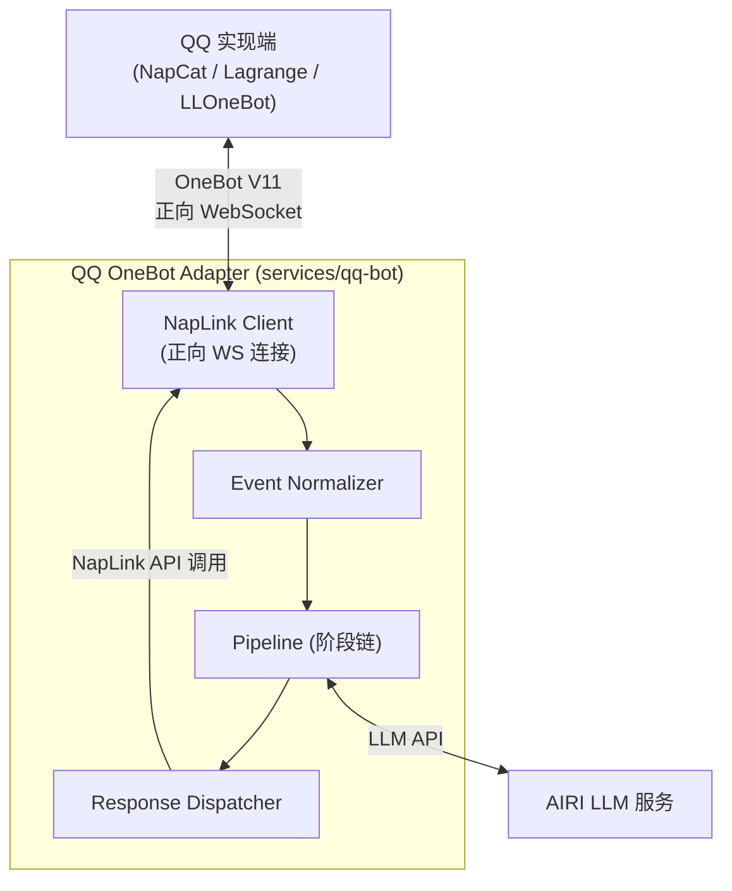

Project AIRI 的 QQ 平台接入适配器，基于 OneBot V11 协议，使用 NapLink SDK 通过正向 WebSocket 连接 NapCat，采用流水线架构处理消息。

</aside>

## 项目概述

### 设计原则

- **先专注 QQ，后抽象通用** — 当前对 QQ 特有概念（群、好友、临时会话、戳一戳等）做一等公民支持，流水线设计保持可扩展性但不急于跨协议抽象
- **规则前置，LLM 后置** — 唤醒判定、频率限制等用规则层前置过滤，节省 LLM token
- **配置驱动，非硬编码** — 所有行为参数通过统一配置文件管理，支持热重载
- **适配器只做协议转换** — 业务逻辑全部在流水线中处理

### 技术选型

- **语言**：TypeScript（与 AIRI 主仓库一致）
- **OneBot SDK**：[NapLink](https://naplink.github.io/)（`@naplink/naplink`）— 现代化 NapCat SDK，类型安全，内置重连/心跳/超时控制
- **连接方式**：正向 WebSocket（bot 主动连接 NapCat）
- **运行时**：Node.js

---

## 架构设计

### 整体架构图



### 四大模块

1. **NapLink Client** — 协议连接层，使用 NapLink SDK 管理正向 WebSocket 连接（内置心跳、指数退避重连、API 超时控制），不再需要手写 WS 逻辑
2. **Event Normalizer** — 从 NapLink 的层级化事件回调（如 `message.group`、`notice.notify.poke`）中提取数据，映射为统一的 `QQMessageEvent`
3. **Pipeline** — 可配置的 7 阶段链，消息在各阶段间流转
4. **Response Dispatcher** — 调用 NapLink 封装的 API 方法（如 `client.sendGroupMessage()`、`client.sendPrivateMessage()`）发送响应，不再手动构造 OneBot action JSON

---

## 统一事件模型

```tsx
// types/event.ts

interface QQMessageEvent {
  // 基本信息
  id: string // 消息唯一ID
  timestamp: number // 收到时间戳

  // 来源
  source: {
    platform: 'qq'
    type: 'private' | 'group' | 'guild' // 私聊/群聊/频道
    userId: string // 发送者QQ号
    userName: string // 昵称
    groupId?: string // 群号（群聊时）
    groupName?: string // 群名
    sessionId: string // 统一会话ID = "qq:{type}:{groupId|userId}"
  }

  // 消息内容
  raw: unknown // NapLink 原始事件 data（实际为 GroupMessageEventData 等，按需断言）
  chain: InputMessageSegment[] // 标准化消息链（P2：含 ReplySegment，输入侧）
  text: string // 纯文本提取（便于快速匹配）

  // 流水线上下文（各阶段可写入）
  context: PipelineContext

  // 控制
  stopped: boolean // 阶段可设置，中止后续流水线
}

interface MessageSegment {
  type: 'text' | 'image' | 'at' | 'reply' | 'face'
    | 'file' | 'voice' | 'forward' | 'poke'
  data: Record<string, unknown>
}

interface PipelineContext {
  isWakeUp: boolean // 是否触发了唤醒条件
  wakeReason?: string // 唤醒原因
  rateLimitPassed: boolean // 是否通过频率限制
  sessionHistory: InputMessageSegment[][] // 最近N条上下文（P2：输入侧）
  response?: ResponsePayload // undefined = 无阶段产生响应; kind:'silent' = 有意静默
  extensions: PipelineExtensions // 集中定义，见 pipeline/extensions.ts
}
```

---

## 流水线阶段设计（7 阶段）

参考 AstrBot 的 9 阶段流水线，针对 QQ 场景精简为 7 个阶段。


### 阶段返回值

```tsx
type StageResult
  = | { action: 'continue' } // 继续下一阶段
    | { action: 'skip' } // 跳过后续，不回复
    | { action: 'respond', payload: ResponsePayload } // 提前回复并终止
```

### ① FilterStage — 基础过滤

**职责**：过滤噪声消息（合并 AstrBot 的 WakingCheck + Whitelist）

**过滤逻辑**：

- 过滤 QQ 管家（`user_id: 2854196310`）等系统号
- 黑名单用户/群过滤
- 白名单模式（如果开启，仅允许白名单群/用户）
- 过滤空消息、纯表情消息（可配置）

**配置项**：

```tsx
filter: {
  blacklistUsers: string[]      // QQ号黑名单
  blacklistGroups: string[]     // 群号黑名单
  whitelistMode: boolean        // 是否启用白名单模式
  whitelistGroups: string[]     // 白名单群
  ignoreSystemUsers: string[]   // 系统用户 (默认含 QQ管家)
  ignoreEmptyMessages: boolean  // 过滤纯表情/空消息
}
```

### ② WakeStage — 唤醒判定

**职责**：判定这条消息是否需要 bot 响应

**唤醒条件（优先级从高到低）**：

1. 私聊消息 → 始终唤醒
2. @bot → 始终唤醒（去除 @段 后传递正文）
3. 回复 bot 消息 → 唤醒
4. 关键词触发 → 可配置的前缀/关键词列表
5. 随机唤醒 → 群聊中以概率 P 触发（模拟主动参与，可选）

**写入 context**：`isWakeUp`, `wakeReason`（`'private' | 'at' | 'reply' | 'keyword' | 'random'`）

**配置项**：

```tsx
wake: {
  keywords: string[]             // 触发关键词 ["airi", "爱莉"]
  keywordMatchMode: 'prefix' | 'contains' | 'regex'
  randomWakeRate: number         // 0~1, 群聊随机唤醒概率 (0=关闭)
  alwaysWakeInPrivate: boolean   // 私聊始终唤醒 (默认true)
}
```

### ③ RateLimitStage — 频率限制

**职责**：防止 bot 刷屏，独立为流水线阶段（参考 AstrBot）

**限制维度**：

- **per-session**：每个会话(群/私聊) N 条/分钟
- **per-user**：同一用户 N 条/分钟
- **global**：全局 N 条/分钟
- **cooldown**：回复后冷却 X 秒内不再响应同一会话

**被限流策略**：静默丢弃 或 回复提示

**配置项**：

```tsx
rateLimit: {
  perSession: { max: number, windowMs: number }   // e.g. { max: 10, windowMs: 60000 }
  perUser: { max: number, windowMs: number }
  global: { max: number, windowMs: number }
  cooldownMs: number              // 单次回复后冷却时间
  onLimited: 'silent' | 'notify'
  notifyMessage?: string          // 限流提示语
}
```

### ④ SessionStage — 会话上下文管理

**职责**：维护每个会话的消息历史，为 LLM 提供上下文

**行为**：

- 维护 per-session 的消息环形缓冲区（默认最近 50 条）
- 将历史注入 `context.sessionHistory`
- 支持上下文窗口裁剪（传给 LLM 时取最近 N 条）
- 会话超时重置（可配置，如 30 分钟无消息则清空上下文）

**配置项**：

```tsx
session: {
  maxHistoryPerSession: number // 缓冲区大小 (默认50)
  contextWindow: number // LLM上下文窗口 (默认20)
  timeoutMs: number // 会话超时 (默认 30min)
  isolateByTopic: boolean // QQ频道话题隔离 (预留)
}
```

### ⑤ ProcessStage — 核心处理

**职责**：消息的实际处理，业务逻辑核心

**处理优先级**：

1. **命令匹配** → `/help`, `/status`, `/clear` 等内置命令
2. **插件钩子** → 可注册的自定义处理器（预留扩展点）
3. **LLM 处理** → 通过 `@xsai/generate-text` 调用 OpenAI 兼容 LLM API

**LLM 处理流程**：构建 prompt → 通过 `@xsai/generate-text` 调用 OpenAI 兼容 API → 解析响应 → 写入 `context.response`

**配置项**：

```tsx
process: {
  commands: {
    prefix: string               // 命令前缀 (默认 "/")
    enabled: string[]            // 启用的内置命令
  }
  llm: {
    endpoint?: string            // YAML 优先，fallback: env.LLM_API_BASE_URL
    apiKey?: string              // YAML 优先，fallback: env.LLM_API_KEY
    model?: string               // YAML 优先，fallback: env.LLM_MODEL
    systemPrompt: string
    temperature: number
    maxTokens: number
  }
}
```

### ⑥ DecorateStage — 响应装饰

**职责**：对 LLM 输出做后处理，适配 QQ 消息格式

**行为**：

- 长消息分割（QQ 单条消息有长度限制）
- Markdown → QQ 消息格式转换
- ~~添加引用回复（reply segment）~~ → 改为设置 `response.replyTo ??= event.id`（声明式，Dispatcher 统一注入 ReplySegment）
- 图片/表情嵌入处理
- 敏感词替换/过滤（可选）

**配置项**：

```tsx
decorate: {
  maxMessageLength: number // 单条消息最大长度 (默认4500)
  splitStrategy: 'truncate' | 'multi-message'
  autoReply: boolean // 是否自动引用原消息
  contentFilter: {
    enabled: boolean
    replacements: Record<string, string>
  }
}
```

### ⑦ RespondStage — 发送响应

**职责**：把处理结果通过 NapLink API 发送

**行为**：

- 从 `context.response` 读取响应 → 调用 NapLink 封装的 `client.sendGroupMessage()` / `client.sendPrivateMessage()` 发送
- 多条消息间添加发送延迟（模拟打字）
- 合并转发消息（forward）的构造
- 发送失败重试：业务层最多 2 次（NapLink 自身也有 `api.retries` 兜底）

**配置项**：

```tsx
respond: {
  typingDelay: { min: number, max: number }  // 模拟打字延迟范围(ms)
  multiMessageDelay: number      // 多条消息间隔(ms)
  retryCount: number             // 发送失败重试次数
  retryDelayMs: number
}
```

---

**配置优先级**：YAML 文件 > 环境变量 > 内置默认值

LLM 相关字段（`endpoint`、`apiKey`、`model`）支持 env fallback，解析逻辑：

`config.process.llm.endpoint ?? env.LLM_API_BASE_URL`

`config.process.llm.apiKey ?? env.LLM_API_KEY`

`config.process.llm.model ?? env.LLM_MODEL`

所有配置使用 Valibot schema 做运行时验证 + 默认值填充。

</aside>

---

## 目录结构

```jsx
services/qq-bot/
├── src/
│   ├── index.ts                 # 入口：初始化 NapLink → 注册事件 → client.connect()
│   ├── config.ts                # 配置类型 + 默认值 + 加载
│   ├── client.ts                # NapLink 实例创建与生命周期管理
│   ├── types/
│   │   ├── index.ts             # Barrel export（re-export 所有公共类型和工厂函数）
│   │   ├── context.ts           # PipelineContext + WakeReason + StageResult（决策 ①）
│   │   ├── event.ts             # QQMessageEvent + EventSource + buildSessionId
│   │   ├── message.ts           # MessageSegment 定义
│   │   └── response.ts          # ResponsePayload 定义
│   ├── normalizer/
│   │   └── index.ts             # NapLink 事件 data → QQMessageEvent 映射
│   ├── dispatcher/
│   │   └── index.ts             # 调用 NapLink API (sendGroupMessage 等) 发送响应
│   ├── pipeline/
│   │   ├── extensions.ts     # PipelineExtensions 集中定义
│   │   ├── runner.ts            # 流水线执行引擎
│   │   ├── stage.ts             # Stage 抽象接口
│   │   ├── filter.ts            # ① FilterStage
│   │   ├── wake.ts              # ② WakeStage
│   │   ├── rate-limit.ts        # ③ RateLimitStage
│   │   ├── session.ts           # ④ SessionStage
│   │   ├── process.ts           # ⑤ ProcessStage
│   │   ├── decorate.ts          # ⑥ DecorateStage
│   │   └── respond.ts           # ⑦ RespondStage
│   ├── commands/
│   │   ├── index.ts             # 命令注册表
│   │   ├── help.ts
│   │   ├── status.ts
│   │   └── clear.ts
│   └── utils/
│       ├── logger.ts                # 统一日志（两阶段初始化 + 注册表 + 彩色输出）
│       ├── naplink-logger-adapter.ts # NapLink Logger 接口适配层
│       ├── message-buffer.ts        # 环形缓冲区
│       └── rate-limiter.ts          # 令牌桶/滑动窗口实现
├── config.example.yaml          # 配置示例
├── package.json                 # 依赖: @naplink/naplink
└── tsconfig.json
```
---

## 关键参考链接
- **OneBot V11 标准**：[11.onebot.dev](http://11.onebot.dev)
- **NapLink SDK**：[naplink.github.io](http://naplink.github.io)（`pnpm add @naplink/naplink`）
- **NapCat**：[github.com/NapNeko/NapCatQQ](http://github.com/NapNeko/NapCatQQ)（推荐的 QQ OneBot 实现端）
- **Lagrange**：[github.com/LagrangeDev/Lagrange.Core](http://github.com/LagrangeDev/Lagrange.Core)
- **AstrBot**：[github.com/AstrBotDevs/AstrBot](http://github.com/AstrBotDevs/AstrBot)（⭐ 25.9K）
